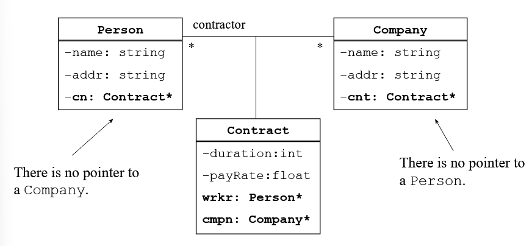

```c++
enegyBill(double totAm, double totGst, int EnUse, string due, int ref):
    totalAmount(totAm), GST(totGst), energyUsed(EnUse), dueDate(due), reference(ref)
{
    //do nothing
}


// is equivalent to:
enegyBill(double totAm, double totGst, int EnUse, string due, int ref)
{
    totalAmount = totAm;
    GST = totGst;
    energyUsed = EnUse;
    dueDate = due;
    reference = ref;
}
```

## Association
- has `a` relationship
```c++
class A{
    int valA;
    public:
        A(int valA){
            this.valA -> valA;
        }
};


class B{
    int valB;
    A objA;
    public:
        // normal constructor
        B(int numB, int numA){
            valB = numB;
            objA = A(numA);
        }
        // special constructor
        B(int numB, int numA): objA(numA), valB(numB){}

        // you need to use this mechanism wisely, otherwise it will be confusing
        // the following is a better way
        B(int numB, int numA): objA(numA){
            valB = numB;
        }
};
```



:bangbang: refer this at the [Model.cpp](./Model.cpp) Association class part
```c++
class Person{
string name;
	Contract *contr; //association via Contract class 
public:    
    Person(string Name="") : name(Name), contr(NULL) {}
    string getName() const  { return(name);}
	void setContract(Contract *cn) { contr = cn;}
	Contract *getContract() const { return( contr); }
};

class Company{
    string name;
    string addresss;
	Contract *contr; //association via Contract class 
public:    
	Company(string Name="") : name(Name), contr(NULL) {}  
	string getName() const { return(name); }
	void setContract(Contract *cn) { contr = cn;}
	Contract *getContract() const { return( contr); }
};

class Contract{
    Person *pers;  // association link to the class Person  
    Company *comp; // association link to the class Company
	int contNum;    
    int duration;
	static float rate;    
public:       
    Contract( Person* worker, Company* empl, int cN, int dr ) : pers(worker), comp(empl), contNum(cN), duration(dr) 
	 {
	    worker->setContract( this ); // set a link Person->Contract
	    comp->setContract( this );   // set a link Company->Contract
	 }       

    string getPersonName() const { return(pers->getName());}    
	string getCompName() const { return(comp->getName()); }   
    float getRate() const { return(rate); }	
    int getDuration() const { return(duration); }		   
    int getContractNumber() const { return(contNum); }
};
float Contract::rate = 70.00;
```

```c++
int main()
{  
    Person *worker = new Person( "John" );  
    Company *Bell = new Company( "Bell Pty Ltd" );  

    Contract *cont1 = new Contract(worker,Bell,5247,12 );  
    
    cout << worker->getName() <<" has a contract number " <<worker->getContract()->getContractNumber() <<" with "<<worker->getContract()->getCompName() <<endl;
    
    cout<< "Duration: " << worker->getContract()->getDuration() <<" months"<<endl;
    cout<< "Rate: $" << worker->getContract()->getRate() <<"/hr"<<endl;

    return(0);
}
```
Output:
```powershell
John has a contract number 5346 with Bell Pty Ltd
 Duration: 12 months
 Rate: 70 $/hr
```


```c++
// Person.h
#include <string>
class Person{
private:
    string name;
    int age;
public:
    Person(string name, int age);
    void display();
} 

// Person.cpp
#include <string>
#include "Person.h"

Person::Person(string name, int age){
    bla bla
}

void Person::display(){
    bla bla
}

// Person.o

// filep to pass: Person.h, Person.o

// main.cpp
#include ....
#include "Person.h"

int main()
{
    Person a = new Person("Benson", 5346);
    return 0;
}
```