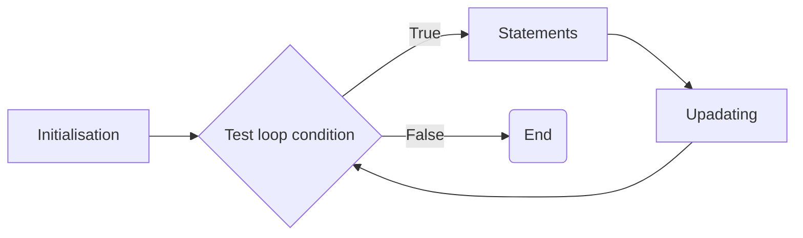
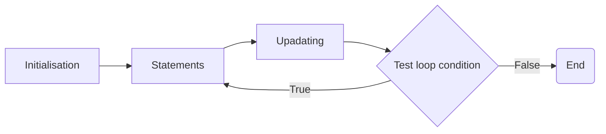

# Notes for CPP
|Content|Section|
|---|---|
|[<kbd>Procedural-Programming</kbd>](#procedural-programming)|[<kbd>Why is it useful?</kbd>](#why-is-it-useful)|
|[<kbd>Memory and Pointer</kbd>](#memory-and-pointer)|[<kbd>Pointing to memory</kbd>](#pointing-to-memory)<br>[<kbd>Referencing</kbd>](#referencing)<br>[<kbd>Pass by reference</kbd>](#pass-by-reference)<br>[<kbd>Pointers</kbd>](#pointers)<br>[<kbd>Summary</kbd>](#summary-of--and--operators)|
|[<kbd>Array</kbd>](#arrays)|[<kbd>Arrays and Pointers</kbd>](#arrays-and-pointers)|
|[<kbd>Function Pointer</kbd>](#function-pointer)||
|[<kbd>Constructor and Destructor</kbd>](#constructors-and-desctructors)|[<kbd>Type of Member Functions</kbd>](#types-of-member-functions)<br>[<kbd>Object Management</kbd>](#object-management)<br>[<kbd></kbd>]()|
|[<kbd>Special Keyword</kbd>](#special-keyword)|[<kbd>`void*` (void pointer)</kbd>](#void-void-pointer) <br>[<kbd>`typedef`</kbd>](#typedef)<br>[<kbd>`auto`</kbd>](#auto)<br>[<kbd>`nullptr` (Null Pointer)</kbd>](#nullptr-null-pointer)<br>[<kbd>const vs constextr</kbd>](#const-vs-constextr)<br>[<kbd>`sizeof` operator)</kbd>](#sizeof-operator)| 


## Procedural Programming
- Procedures, AKA routines, subroutines and functions
- declared or defined independently of the main program construct

### > Why is it useful
The following is an example list of -procesure calls in a program:
```
Step 1: Call Procedure A
Step 2: Call Procedure B
Step 3: Call Procedure C
Step 4: Call Procedure A
Step 5: Call Procedure C
Step 6: Call Procedure B
Step 7: Call Procedure A
```

- Suppose each procedure has 100 lines of code.  
- Without seperate the program into fews procedure, the main program will have 700 lines of code.  
- The code might be referred to as <kbd>unstructed</kbd> or <kbd>sequential</kbd>
- If there is a bug in procedure A, we may spend too mach time on finding all bugs and debugging them. Which is time-wasting and not efficient.
- <kbd><b>Advantages</b></kbd>
    - code can be reused 
    - code that defined to carry out a specific function can be easily transferred to another program
    - program flow can be more readily tracked
        - easier for debugging
- <kbd><b>Disadvantages</b></kbd>
    - The exactness of the rules
        - Each individual function contain exact rules regarding the input and output
    - Similar but not identical pieces of code must be rewritten


---
## Memory and Pointer
### > Pointing to memory

- Primitive types map directly on to memory entities like bytes and words
- most processors are designed to work with these entities
- Allows C++ to efficiently use the hardware withiout there being an abstraction in between
- Memory is effectively seen as a sequence of bytes 
- each typed object is given a location in memory, and values are placed in such objects

- Visuallize the memory location
  |Memory location|Values|Type|
  |---|---|---|
  |1008|24|int|
  |1016|||
  |1024|"This is a string"|string|
  |1032|||

### > Referencing
-----------------------**Example 1**-----------------------
- We can access to the memory location of the variable by using the address-of operator `&`
```c++
int value = 5;

cout << "Value: " << value << endl << "Address: " << &value << endl;
```
-----------------------**Example 2**-----------------------
- We can use this operator to create an alies for specific variable
```c++
int value = 5;
int &referenceValue = value;

cout << "Value: " << value << endl << "Address: " << &value << endl;
cout << "referenceValue: " << referenceValue << endl << "Address: " << &referenceValue << endl;
// both the value and referenceValue share the same value and the memory location
```
> Be careful !!!  
 Since the value as well as the memory location for both `value` and `referenceValue` are the same,  
 Any changes on value for both of the variable will take affect on both variable

-----------------------**Example 3**-----------------------
```c++
int otherValue = referenceValue;
cout << "otherValue: " << otherValue << endl << "Address: " << &otherValue << endl;
```
- The above code show a declaration of a new variable `otherValue` with an initial value equal to the value in `value`
- This is because `referenceValue` is the alias of `value` 
- At the end, `otherValue` only shared/copy the same initial value as `value` but not the same memory location
- In this case, any change to the value of `otherValue` will not affect the value of `value` and `referenceValue`

### > Pass by reference

- Ways to pass variable to function:
    - pass by value (when the function does not need to change the value of the argument)
    ```c++
    int addOne(int x);
    ```
    - pass by reference (when the function will change the value of the argument)
    ```c++
    void addOne(int &x);
    ```
    - mix
    ```c++
    void sum(int x, int y, int &result);
    ```

    [<kbd>Example</kbd>](./memory/src/reference.cpp)

### > Pointers
- an object that store the memory address of the variable
- Use the `*`, AKA deferencing operator, to declare a pointer
> Be careful  
 It is tied to the variable name, not the type name 
```c++
// Declaring a single pointer in a single line
int* ptr1;
int * ptr2;
int *ptr3;

// Declaring multiple pointers in a single line
int * ptr4, * ptr5;
```
- since the above are the pointer to an `int`, so it stores the location of an `int` 

#### >> How to use pointers
-----------------------**Example 1**-----------------------
```c++
int value;
int * ptr;
ptr = &value;

cout << "Value of value: " << value << endl;
cout << "Value of ptr : " << ptr << endl;
```
Output :
```shell
Value of value: 5
Value of ptr : 0xa17c9ff874
```
Explaination  
1. A variable `value` is declared and alocates a memory address to it without any value
2. An integer pointer `ptr` is declared and alocates a memory address to it without any value
3. The memory address of the variable `value` is then assigned to the pointer `ptr`
> the value of `ptr` may be vary everytime when user execute the main program or redeclare the variable as the compiler need to allocate memory location that have enough space to store the type of variable

-----------------------**Example 2**-----------------------
- change value of the variable that it is pointed to
```c++
// this example continue from the previous code
*ptr = 5;
cout << value << endl;
// value = 5
```

### > Summary of `&` and `*` operators
- `&` can be used to `extract` the memory address of the variable
- `*` can be used to 
  - `declare` a ==pointer== to store the memory location of the variable that it is pointing to
  - `dereference` the ==memory address of the pointer variable== and get access to the variable's value that the pointer is pointing to
---
## Arrays
### > Intro
- collections of variables of the same type and fixed size
- Ways to initialize an array
  ```c++
  // array with a fixed length and memory location is set up but no initialization
  const int postCodeLength = 4;
  int postCode[postCodeLength];

  // initialize all four locations to 0
  int postCode[postCodeLength] = {0};

  // access element using index
  postCode[2] = postCode[1] + 1;

  // array of size 3 with values 0,1,2
  const unsigned sz = 3;
  int a1[sz] = {0,1,2};

  // array which the size is inffered from the initialiser
  int a2[] = {0,1,2};

  // array with some values is not initialized
  int a3[5] = {0,1,2};
  string a4[4] = {"Hello", "World!"};
  // Notes:
    // the unitialized part are value-intialized (int -> 0)(string -> empty string)

    cout << "Element in a3 array" << endl;
    for (int i = 0; i < 5; i++){
        cout << a3[i] << endl;
    }

    cout << "\nElement in a4 array" << endl;
    for(int i = 0; i < 4; i++){
        cout << a4[i] << endl;
    }
  ```
  Output :
  ```shell
  Element in a3 array
  0
  1
  2
  0
  0

  Element in a4 array
  Hello
  World!


  ```
#### > Character Array
- can be initailised using a string literal, and end with a null character
```c++
char a1[] = {'c', '+', '+'};        // actual size = 4

// '\0' represent null character
char a2[] = {'c', '+', '+', '\0'};  //actual size = 4

// initialize a char array with string literal, which will end with a null character (\0)
// Thus the compiler will then initialize the a3 with size of 4
char a3[] = {"c++"};                

// This will complain as there is no extra space for the null to be added
const char a4[6] = "123456";
// actual space required = 7 (6 number + 1 null character)
// space allocate = 6
```
### > Arrays and Pointers
- when we use an object of array type, we are actually using a pointer to the first element of the array
- By default, arrays are passed by reference  
```c++
    int arr[] = {1, 2, 3, 4, 5, 6};
    cout << "Value of arr (without specify the index): " << arr << endl;
    cout << "Value of arr (without specify the index but dereference): " << *arr << endl;
    cout << "Value of arr (with specify the index): " << arr[0] << endl;
```
Output : 
```shell
Value of arr (without specify the index): 0x3f63dffda0
Value of arr (without specify the index but dereference): 1
Value of arr (with specify the index): 1
```
-----------------------**Example 1: pass array to function**-----------------------
```c++
void AddArray(int size, const float A[], const float B[], float C[]){
    for(int i = 0; i < size; i++){
        C[i] = A[i] + B[i];
    }
}

void printArr(int size, const float C[]){
    for(int i = 0; i < size; i++){
        cout << C[i] << endl;
    }
}
// pass array without the size to a function
void printArr(const float C[]){
    int size = sizeof(C) / sizeof(float);    
    for(int i = 0; i <  size; i++){
        cout << C[i] << endl;
    }
}

int main(){
  const int ArySize = 5; 
	float Ary1[ArySize]={1,2,3,4,5};
	float Ary2[ArySize]={6,7,8,9,10};
	float Ary3[ArySize];
	
	AddArray(ArySize, Ary1, Ary2, Ary3); 
    printArr(ArySize, Ary3);

    cout << endl;

    // pass array without the size to a function
    printArr(Ary3);

    cout << "program end" << endl;
    return 0;
}
```
```shell
7
9
11
13
15

7
9
program end
```
***Other way to pass array***
```c++
int SumArray(int arr[], int n){
  int i, sum = 0;
  for(i = 0; i < n; i++){
    sum += arr[i];
  }
  return sum;
}
int main(){
  int arr[10] = {1,2,3,4,5,6,7,8,9,10};
  int result1 = SumArray(arr, 10);
  // explicitly specify the address of the first element of the array 
  int result2 = SumArray(&arr[0], 10);

  // we can specify the second element of the array too
  int result3 = SumArray(&arr[1], 9); 
}
```
-----------------------**Example 2: Referencing Array**-----------------------
```c++
int A[10];
int* B = A; // get the address of array A
cout << *B << endl; // get the value of A[0]
cout << B[6] << endl;  // get the value of A[6]
```
```c++
int A[3] = {1,2,3};
cout << "Value of A (dereference array only): " << *A << endl;

cout << "Value of *(A+1): " << *(A+1) << endl;
``` 
Output :
```shell
Value of A (dereference array only): 1
Value of *(A+1): 2
```
The question is:
- How much `1` does it worth for that? Is it 1kb or 1Mb?
- Just kidding. It is actually worth for one memory location's of the array type
---
## Function pointer
- similar to pointer for data variable
- but it is used to point to functions 
- This they hold the memory location of the function
**How to declare pointer to functions**
```c++
// this is a pointer to function that take in an int and return char
char (*g) (int);
// while this is a pointer to function that take in two int and return char
char (*h) (int, int);

// wrong way to declare pointer to functions
int *f (int);
// this is not a pointer to function, 
// but it is a normal function that take in int and return an int pointer
```

- Prerequisites:
  - the parameter of the pointer to the function must match with the parameter of the referenced function as shown above
```c++
// The function that is use for the following example
int add(int x, int y){
  return x + y;
}

int minus(int x, int y){
  return x - y;
}
```
-----------------------**Example 1: Call Functions**-----------------------
```c++
// declare a pointer to function
int (* operation) (int, int);

(* operation) = add;

// or you can declare it like this
int (* operation) (int, int) = add;


int result = operation(1,3);
cout << "Result: " << result << endl;

(* operation) = minus;
result = operation(3,1);
cout << "Result: " << result << endl;


```
Output :
```shell
Result: 4
Result: 2
```
-----------------------**Example 2: Pass functions**-----------------------
```cpp
// additional function to achieve passing function
int performOperation(int (* operationPtr) (int, int), int a, int b){
  return operationPtr(a, b);
}   

int main(){
  int result = performOperation(add, 5, 9);
  return 0;
}
```
**Why function can be pass to another function?**
- As in C and C++, functions are treated as first-class citizens, which means that they are able to passed around
- when we said passing a function, it is actually providing the funciton address as the parameter to another function 
---
## Control Structures and Repetition statement
### > Control Structures
#### ==if==
```
if(Boolean expression is true){
  statement to execute;
}
```
#### ==if-else==
```
if(Boolean expression is true){
  statement to execute;
}else{
  statement to execute;
}
```
#### ==Compound boolean expressions==
- AND: &&
  - if(age >= 18 && countryCode == 61)
- OR: ||
  - if(countryCode == 61 || countryCode == 64)

#### ==Switch==
```
switch(variable)
{
  case 1:
          statement to execute
          break;
  case 2:
          statement to execute
          break;  
  case 3:
          statement to execute
          break;
  case 4:
          statement to execute
          break;
  default:
        statement to execute
        break;
}
```
### > Repetition statement
- it has an intended to implement loops that repeat an action as ling as some condition remains true
- Components in a loops:
  - initialise loop
  - test loop condition
  - update
**Pre-test loop** 

Post-test loop

#### While loop
```cpp
int n, sum, counter;
cout << "Enter one number: ";
cin >> n;
sum = 0;
while(counter <= n){
  sum += counter;
  counter++;
}
```

#### For loop
```cpp
int n, sum;
cout << "Enter one number: ";
cin >> n;
sum = 0;
for(int counter = 0; counter <= n; counter ++){
  sum += counter;
}
```
**Variation of for loop**
- several initialization expressions seperated by commas
```cpp
for(int factorial = 1, counter = 1; counter <= n; ++counter){
  factorial *= counter
}
```
- no initialization expressions 
```cpp
for( ; n <= 0; n--){
  cout << "*" ;
}
```
- simple initialization expressions of a delay
```cpp
for(int counter = 1; counter <= n; ++counter);
```
- infinite loop (until terminae inside the loop body)
```cpp
for( ; ; ){
  ...
}
```
- Range for loop
```cpp
for(declaration : expression){
  statement to execute
}
```
---
## Dynamic Memory allocation
- carry out by using a special type of operator that directly communicate with the Menory Manager
- While the programmer has to specify how much memory is reuqired
- So the memory manager will find a location currently available
### > Stack or Heap
- The static objects will be stored in memory on the stack
- Allocation of these memory is at the run-time, and ==use of this memory is persistent==
- Thus we need to explicitly say when we want to stop using it
- **Static Variable**
  - the variable persists beyond scope and isn't re-initialized with each call to the function
  - the class variable of which it is shared among the class object.
### `new` & `delete`
- `new` is used to dynamically allocate memory 
- it is a type safe operation, which return a pointer to the typr given
- `delete` is used to free up memory / deallocate the memory
  - this is mandatory to prevent memory leak
```cpp
int * ptr = new int;
delete ptr;       // to deallocate memory


// we can initialise the variables when we setup the memory
int *p = new int(5);

delete p;
```
### `new[]`
- used to create dynamic array
```cpp
int *intArr;
intArr = new int[100];
// initialise array
for(int i = 0; i < 100; i++){
  intArr[i] = 25-i;
}

delete[] intArr;    // deallocate memory for dynamic array
```
### Notes for `delete[]`
Case 1: pointer array of pointers 
```cpp
Person **p = new Person*[2];
p[0] = new Person("Peter");
p[1] = new Person("Alex");
```
- In this case, delete[] will only cause the `p` pointer to be released, not the actual objects
- To delete this: 
  1. loop through the `p` to delete each of the objects by specifying the index `delete p[index]`
  2. After delete all, now you may delete the `p` pointer array
```cpp
void deallocateMemory(){
  for(int i = 0; i < 2; i++){
    delete p[i];
  }
  delete[] p; 
}
```
Case 2: pointer array of pointer array
```cpp
float **fArr;
fArr = new float[10];
for(int i = 0; i < 1; i++){
  fArr[i] = new float[10];
}

// some initialisation

// deallocate memory
for(int i = 0; i < 1; i++){
  delete[] fArr[i];
}
delete[] fArr;

```
---
## Abstract data types
### > Structs
- similar to class
- but the default access specifiers is public (if did not specify)
- can have member function just like a class does (by default they are public)
- use it if the ==members are going to be public== 
**Syntax**
```cpp
struct StudentType{
  int id;
  bool isGrad;
};
```
Declare a new type of struct
```cpp
StudentType s1, s2;
```
Access the individual field of a structure
```cpp
s1.id = 123;
s2.id = s1.id + 1;
s1 = s2;        // copy fields of s2 to s1
```
Nested struct (arbitrarily)
```cpp
struct AddressType{
  string city;
  int zip;
};
struct StudentType{
  int id;
  bool isGrad;
  AddressType addr;
};
```
Access the nested struct fields
```cpp
StudentType s3;
s3.addr.zip = 53706;
```

member function
```cpp
struct Test{
  string name;
  int number;
  void setTest(string, int);
  void showTest();
}

void Test::setTest(string TestName, int TestNumber){
  name = TestName;
  number = TestNumber;
}

void Test::showTest(){
  cout << "Test string " << name << endl;
  cout << "Number for this "  <<number << endl;
}
```
#### static const in struct
- this variable can only be declare and initialise in a struct or class IF IT IS A INTEGRAL / ENUMERATION TYPE
- FOR NON-INTEGRAL TYPE, you can only declare in the struct, and then initialise outside of the struct/class
```cpp
struct Test{
  static const int aStaticInt = 5;
  static const double aStaticDouble;
  // static const double aStaticDouble = 0.5;     
  // error: 'constexpr' needed for in-class initialization of static data member 'const float Test::aStaticDouble' of non-integral type [-fpermissive]
  static const string aStaticString; 
  // static const string aStaticString = "Hello world"; 
  // error: in-class initialization of static data member 'const std::string Test::aStaticString' of non-literal type
};

const double Test::aStaticDouble = 0.5;
const string Test::aStaticString = "Hello world";
int main(){
  Test test;
  cout << test.aStaticInt << endl << test.aStaticString << test.aStaticDouble << endl;
    
  return 0;
}
```
### > Unions

---
## Constructors and Desctructors
### > Types of Member Functions
- **Inpector functions (access functions/ getter)**
  - return information about an object's state, or display some or all of an object's attributes
  - e.d. getName(), toString()
  - Subcategory > **predicate function**
    - test various conditions
    - e.g. isDigit(), fail() 
- **Mutator functions (implementors/ setter)**
  - functions that change an object's attributes value
  - e.g. setName(), setAge()
- Auxiliary functions (facilitators)
  - function that perfom actions or services
  - e.g. sortAscending(), findLowestValue()
- Object Management functions 
  - constructor 
    - create object
  - destructor
    - destroy object

### > Object Management
#### Constructor
- called automatically
- initializes the object in specified way
- no return type
- Two basic types
  - default (no arguments)
  - non-default (at least one argument)
#### Desctructor
- called for an object whenever the object goes out of scope
---
## Handling files
### > Subheading
---
## Heading
### > Subheading
---
## Special Keyword
### > <mark style="background-color:#FFA50035;">`void*`</mark> (void pointer)
- used to hold the address of any type, but without the type being known
  - don't access the content through the void pointers
  - **dereference** won't work in this case
- This is used when we only want to deal with the memory location
  - e.g. sizeof(void *)
- What if we really need to access the content
  - we need to cast it
    - (type *) vptr
  - In this case, the **void pointer** `vptr` will be converted into a **type pointer**  

-----------------------**Example 1**-----------------------
```c++
int i = 5;
int *ip;
void *vp;
ip = &i;  // get the address of the integer variable
vp = ip;  // automatically cast to void* 

// print out
cout << *vp << endl;    // error: expression must be a pointer to a complete object typeC/C++(852)
cout << *((int*)vp) << endl;
```

### > <mark style="background-color:#FFA50035;">`typedef`</mark>
- used to rename basic type
- Format: `typedef actual_type new_name`
```c++
typedef int number;
number one, two, three;
```
- useful to get rid of deferencing operators that are likely to be around with points ...
```c++
typedef double* DataPtr;
DataPtr Index[10];
// instead of 
double* Index[10];
```
- Another way to decalre alias
```c++
typedef double* DataPtr;
using DP = DataPtr;
DP Index[10];
```

### > <mark style="background-color:#FFA50035;">`auto`</mark>
- allow the compiler to figures out the type of something based on the initializer
```c++
auto whatA = 5;
auto whatB = 5.5;
cout << typeid(whatA).name() << endl;
cout << typeid(whatB).name() << endl;
```

```shell
i
d
```
#### Purpose 1 (the type name is hard to know or hard to write)
Before using `auto`
```c++
template<class T> void printall(const vector<T>& v){
  for(typename vector<T>::const_iterator p = v.begin(); p != v.end();++p){
    cout << *p << endl;
  }
}
```
After using `auto`
```c++
template<class T> void printall(const vector<T>& v){
  for (auto p = v.begin(); p != v.end();++p){
    cout << *p << endl;
  }
}
```
> Explanation : the auto keyword automatically deduce the type of the iterator.  
> The compiler determines the type of `p` based on the type of v.begin(), which is `vector<T>::const_iterator`
#### Purpose 2 (grab the return type from an operation)
```c++
string word = "Elephant";
auto length = word.size();
// the size() of a string class return a object of string::size_type
```
#### Purpose 3 (use in for loop which can receive different sequence type but the same format)
```c++
string str("This is a string");
for(auto c : str){
  cout << c << endl;
}
```
#### Purpose 4 (referencing)
```c++
int num = 5, &ref = num;
auto a = ref;
```
[Not clear about how the above code works](#referencing)

#### Things to be aware (Referencing, `const`, `auto`)
- things to consider
  - top-level const : where the object is contanst
  - low-level const : in compound type, with the pointer or reference being a const object
```c++
const int ci = num, &cr = ci;
auto b = ci;    // int  (only copy the value of the constant)
auto c = cr;    // int
auto d = &num;  // int*
auto e = &ci;   // const int*   (copy the address of the constant make the pointer constant)
// top level const : ci, low-level const: e
```
### > <mark style="background-color:#FFA50035;">`decltype`</mark>
- simlar to auto
- allow us to declare type of a variable based on the return type of the function
```c++
int f(){
  return 5;
}

int main(){
  decltype(f()) variable;
  cout << typeid(variable).name() << endl;
}
```
### > <mark style="background-color:#FFA50035;">`nullptr`</mark> (Null Pointer)
- c++ literal that can be converted to any other pointer type
- ways to set pointer which doesn't point to anywhere
  - `int * ptr = 0;`
  - `int * ptr = nullptr`
- `nullptr` != `NULL`
### > <mark style="background-color:#FFA50035;">`const`</mark> vs <mark style="background-color:#FFA50035;">`constextr`</mark>
- object that declared with `const` qualifier cannot change its value
- object that declared with `constextr` qualifier cannot change its value but can evaluate them in the compile time
```c++
constexpr int square(int x) {
    return x * x;
}

int main() {
    // Compile-time evaluation of the constexpr function
    constexpr int result = square(5);

    // Output the result
    std::cout << "Square of 5 is: " << result << std::endl;

    return 0;
}
```
#### Summary
both `const` and `constexpr` ensure their respective variables and functions are treated as constants, but `constexpr` additionally guarantees compile-time evaluation when possible
### > <mark style="background-color:#FFA50035;">`sizeof`</mark> operator
- this will return the number of bytes that the type occupies
```c++
sizeof int
sizeof (int)
```
You can do this:
```c++
int value;

cout << "sizeof(int): " << sizeof(int) << endl;
cout << "sizeof(value): " << sizeof(value) << endl;
cout << "sizeof(int*): " << sizeof(int*) << endl;
```
Output :
```shell
sizeof(int): 4
sizeof(value): 4
sizeof(int*): 8
```
> for the sizeof(int*) is not equal to sizeof(int) as a pointer require more space which js enough to store memory location, not the data type. 
> On most 32-bit system, the pointer size is 4, while on 64-bit system, the pointer size is 8 which is double of 32-bit system.
### > <mark style="background-color:#FFA50035;">`unsigned`</mark> operator
- the variables that declare as `unsigned` will only store values that is greater than or equal to 0
- if not, the compiler will still compile it but a  gibberish number will be passed to cout