# Notes for CPP
<details>
  <summary>Table of content</summary>

- [Notes for CPP](#notes-for-cpp)
  - [Procedural Programming](#procedural-programming)
    - [\> Why is it useful](#-why-is-it-useful)
  - [Memory and Pointer](#memory-and-pointer)
    - [\> Pointing to memory](#-pointing-to-memory)
    - [\> Referencing](#-referencing)
    - [\> Pass by reference](#-pass-by-reference)
    - [\> Pointers](#-pointers)
      - [\>\> How to use pointers](#-how-to-use-pointers)
    - [\> Summary of `&` and `*` operators](#-summary-of--and--operators)
  - [Arrays](#arrays)
    - [\> Intro](#-intro)
      - [\> Character Array](#-character-array)
    - [\> Arrays and Pointers](#-arrays-and-pointers)
  - [Function pointer](#function-pointer)
  - [Control Structures and Repetition statement](#control-structures-and-repetition-statement)
    - [\> Control Structures](#-control-structures)
      - [==if==](#if)
      - [==if-else==](#if-else)
      - [==Compound boolean expressions==](#compound-boolean-expressions)
      - [==Switch==](#switch)
    - [\> Repetition statement](#-repetition-statement)
      - [While loop](#while-loop)
      - [For loop](#for-loop)
  - [Dynamic Memory allocation](#dynamic-memory-allocation)
    - [\> Stack or Heap](#-stack-or-heap)
    - [`new` \& `delete`](#new--delete)
    - [`new[]`](#new)
    - [Notes for `delete[]`](#notes-for-delete)
  - [Abstract data types](#abstract-data-types)
    - [\> Structs](#-structs)
      - [static const in struct](#static-const-in-struct)
    - [\> Unions](#-unions)
  - [Randomness](#randomness)
    - [\> old school version](#-old-school-version)
    - [\> C++11 version](#-c11-version)
  - [Exception](#exception)
    - [\> Intro](#-intro-1)
    - [\> Unwinding the stack](#-unwinding-the-stack)
  - [Namespace](#namespace)
    - [\> Intro](#-intro-2)
    - [\> Use namespace locally](#-use-namespace-locally)
    - [\> Unamed Namespace](#-unamed-namespace)
    - [\> Nested Namespace](#-nested-namespace)
    - [\> Inline namespace](#-inline-namespace)
    - [\> Namespace alias](#-namespace-alias)
  - [Class and UML](#class-and-uml)
    - [\> What is a class](#-what-is-a-class)
    - [\> Access Specifier/Modifier](#-access-specifiermodifier)
    - [\> Encapsulation](#-encapsulation)
    - [\> Static](#-static)
    - [\> `this` pointer](#-this-pointer)
    - [\> UML](#-uml)
  - [Constructors and Desctructors](#constructors-and-desctructors)
    - [\> Types of Member Functions](#-types-of-member-functions)
    - [\> Object Management](#-object-management)
      - [Constructor](#constructor)
      - [Desctructor](#desctructor)
      - [Question time:](#question-time)
    - [\> Copy And Moving](#-copy-and-moving)
      - [Copy](#copy)
        - [\> Summary for copy contructor and copy assignment](#-summary-for-copy-contructor-and-copy-assignment)
      - [Moving](#moving)
      - [Summary of the copy and moving syntax](#summary-of-the-copy-and-moving-syntax)
  - [Overloading](#overloading)
    - [\> Function Overloading](#-function-overloading)
    - [\> Problem with the overloading](#-problem-with-the-overloading)
    - [\> Operator Overloading](#-operator-overloading)
    - [\> Ways to define operator overloading:](#-ways-to-define-operator-overloading)
  - [Class/Object Relation](#classobject-relation)
    - [\> Multiplicity](#-multiplicity)
    - [\> Dependency](#-dependency)
    - [\> Association](#-association)
      - [\> Multiple Association](#-multiple-association)
      - [\> Labelling Association](#-labelling-association)
      - [\> Self Association](#-self-association)
    - [\> Aggreagation](#-aggreagation)
    - [\> Association vs Aggregation](#-association-vs-aggregation)
    - [\> Composition](#-composition)
    - [\> Nested Class](#-nested-class)
    - [\> Inheritance](#-inheritance)
      - [Advantages](#advantages)
      - [Derived class](#derived-class)
  - [Polymorphism and Multiple inheritance](#polymorphism-and-multiple-inheritance)
    - [\> What is Polymorphism?](#-what-is-polymorphism)
      - [\> Step for any class member function is called](#-step-for-any-class-member-function-is-called)
      - [\> `static_cast`](#-static_cast)
      - [\> Store them as an array](#-store-them-as-an-array)
      - [\> Virtual function](#-virtual-function)
    - [\> Abstract Class](#-abstract-class)
    - [\> How to stop inheritance](#-how-to-stop-inheritance)
    - [\> Multiple Inheritance](#-multiple-inheritance)
    - [\> Diamond Problem](#-diamond-problem)
  - [Handling files](#handling-files)
    - [\> Subheading](#-subheading)
  - [Generic Programming](#generic-programming)
    - [\> Intro](#-intro-3)
    - [\> Function Tempplate and Template Functions](#-function-tempplate-and-template-functions)
    - [\> Syntax](#-syntax)
    - [\> How to call](#-how-to-call)
    - [\> Multiple parameter](#-multiple-parameter)
    - [\> Function Template Overloading](#-function-template-overloading)
    - [\> Mixed template/non-template function argument](#-mixed-templatenon-template-function-argument)
    - [\> Multiple Generic Parameter](#-multiple-generic-parameter)
    - [\> Explicit type specification](#-explicit-type-specification)
  - [Class Templates](#class-templates)
  - [Container](#container)
    - [\> Intro](#-intro-4)
    - [\> Why Container](#-why-container)
      - [\> Queues](#-queues)
      - [\> Stacks](#-stacks)
      - [\> Linked lists](#-linked-lists)
    - [\> Itorators](#-itorators)
      - [\> Smart Pointer?](#-smart-pointer)
  - [Special Keyword](#special-keyword)
    - [\> `void*` (void pointer)](#-void-void-pointer)
    - [\> `typedef`](#-typedef)
    - [\> `auto`](#-auto)
      - [Purpose 1 (the type name is hard to know or hard to write)](#purpose-1-the-type-name-is-hard-to-know-or-hard-to-write)
      - [Purpose 2 (grab the return type from an operation)](#purpose-2-grab-the-return-type-from-an-operation)
      - [Purpose 3 (use in for loop which can receive different sequence type but the same format)](#purpose-3-use-in-for-loop-which-can-receive-different-sequence-type-but-the-same-format)
      - [Purpose 4 (referencing)](#purpose-4-referencing)
      - [Things to be aware (Referencing, `const`, `auto`)](#things-to-be-aware-referencing-const-auto)
    - [\> `decltype`](#-decltype)
    - [\> `nullptr` (Null Pointer)](#-nullptr-null-pointer)
    - [\> `const` vs `constextr`](#-const-vs-constextr)
      - [Summary](#summary)
    - [\> `sizeof` operator](#-sizeof-operator)
    - [\> `unsigned` operator](#-unsigned-operator)
    - [\> `friend`](#-friend)
  - [Special Concept](#special-concept)
    - [\> Singleton](#-singleton)
    - [\> Monostate](#-monostate)
    - [\> Singleton vs Monostate](#-singleton-vs-monostate)
</details>

## Procedural Programming
- Procedures, AKA routines, subroutines and functions
- declared or defined independently of the main program construct

### > Why is it useful
The following is an example list of -procesure calls in a program:
```
Step 1: Call Procedure A
Step 2: Call Procedure B
Step 3: Call Procedure C
Step 4: Call Procedure A
Step 5: Call Procedure C
Step 6: Call Procedure B
Step 7: Call Procedure A
```

- Suppose each procedure has 100 lines of code.  
- Without seperate the program into fews procedure, the main program will have 700 lines of code.  
- The code might be referred to as <kbd>unstructed</kbd> or <kbd>sequential</kbd>
- If there is a bug in procedure A, we may spend too mach time on finding all bugs and debugging them. Which is time-wasting and not efficient.
- <kbd><b>Advantages</b></kbd>
    - code can be reused 
    - code that defined to carry out a specific function can be easily transferred to another program
    - program flow can be more readily tracked
        - easier for debugging
- <kbd><b>Disadvantages</b></kbd>
    - The exactness of the rules
        - Each individual function contain exact rules regarding the input and output
    - Similar but not identical pieces of code must be rewritten


---
## Memory and Pointer
### > Pointing to memory

- Primitive types map directly on to memory entities like bytes and words
- most processors are designed to work with these entities
- Allows C++ to efficiently use the hardware withiout there being an abstraction in between
- Memory is effectively seen as a sequence of bytes 
- each typed object is given a location in memory, and values are placed in such objects

- Visuallize the memory location
  ```cpp
  int x = 24;
  string y = "This is a string";
  // the memory location will be different every time when we restart out program
  ```
  |Memory location|Values|Type|
  |---|---|---|
  |1008|24|int|
  |1016|||
  |1024|"This is a string"|string|
  |1032|||

### > Referencing
-----------------------**Example 1**-----------------------
- We can access to the memory location of the variable by using the address-of operator `&`
```c++
int value = 5;

cout << "Value: " << value << endl << "Address: " << &value << endl;
```
-----------------------**Example 2**-----------------------
- We can use this operator to create an alies for specific variable
```c++
int value = 5;
int &referenceValue = value;

cout << "Value: " << value << endl << "Address: " << &value << endl;
cout << "referenceValue: " << referenceValue << endl << "Address: " << &referenceValue << endl;
// both the value and referenceValue share the same value and the memory location
```
> Be careful !!!  
 Since the value as well as the memory location for both `value` and `referenceValue` are the same,  
 Any changes on value for both of the variable will take affect on both variable

-----------------------**Example 3**-----------------------
```c++
int otherValue = referenceValue;
cout << "otherValue: " << otherValue << endl << "Address: " << &otherValue << endl;
```
- The above code show a declaration of a new variable `otherValue` with an initial value equal to the value in `value`
- This is because `referenceValue` is the alias of `value` 
- At the end, `otherValue` only shared/copy the same initial value as `value` but not the same memory location
- In this case, any change to the value of `otherValue` will not affect the value of `value` and `referenceValue`

### > Pass by reference

- Ways to pass variable to function:
    - pass by value (when the function does not need to change the value of the argument)
    ```c++
    int addOne(int x);
    ```
    - pass by reference (when the function will change the value of the argument)
    ```c++
    void addOne(int &x);
    ```
    - mix
    ```c++
    void sum(int x, int y, int &result);
    ```

    [<kbd>Example</kbd>](./memory/src/reference.cpp)

### > Pointers
- an object that store the memory address of the variable
- Use the `*`, AKA deferencing operator, to declare a pointer
> Be careful  
 It is tied to the variable name, not the type name 
```c++
// Declaring a single pointer in a single line
int* ptr1;
int * ptr2;
int *ptr3;

// Declaring multiple pointers in a single line
int * ptr4, * ptr5;
```
- since the above are the pointer to an `int`, so it stores the location of an `int` 

#### >> How to use pointers
-----------------------**Example 1**-----------------------
```c++
int value;
int * ptr;
ptr = &value;

cout << "Value of value: " << value << endl;
cout << "Value of ptr : " << ptr << endl;
```
Output :
```shell
Value of value: 5
Value of ptr : 0xa17c9ff874
```
Explaination  
1. A variable `value` is declared and alocates a memory address to it without any value
2. An integer pointer `ptr` is declared and alocates a memory address to it without any value
3. The memory address of the variable `value` is then assigned to the pointer `ptr`
> the value of `ptr` may be vary everytime when user execute the main program or redeclare the variable as the compiler need to allocate memory location that have enough space to store the type of variable

-----------------------**Example 2**-----------------------
- change value of the variable that it is pointed to
```c++
// this example continue from the previous code
*ptr = 5;
cout << value << endl;
// value = 5
```

### > Summary of `&` and `*` operators
- `&` can be used to `extract` the memory address of the variable
- `*` can be used to 
  - `declare` a ==pointer== to store the memory location of the variable that it is pointing to
  - `dereference` the ==memory address of the pointer variable== and get access to the variable's value that the pointer is pointing to
---
## Arrays
### > Intro
- collections of variables of the same type and fixed size
- Ways to initialize an array
  ```c++
  // array with a fixed length and memory location is set up but no initialization
  const int postCodeLength = 4;
  int postCode[postCodeLength];

  // initialize all four locations to 0
  int postCode[postCodeLength] = {0};

  // access element using index
  postCode[2] = postCode[1] + 1;

  // array of size 3 with values 0,1,2
  const unsigned sz = 3;
  int a1[sz] = {0,1,2};

  // array which the size is inffered from the initialiser
  int a2[] = {0,1,2};

  // array with some values is not initialized
  int a3[5] = {0,1,2};
  string a4[4] = {"Hello", "World!"};
  // Notes:
    // the unitialized part are value-intialized (int -> 0)(string -> empty string)

    cout << "Element in a3 array" << endl;
    for (int i = 0; i < 5; i++){
        cout << a3[i] << endl;
    }

    cout << "\nElement in a4 array" << endl;
    for(int i = 0; i < 4; i++){
        cout << a4[i] << endl;
    }
  ```
  Output :
  ```shell
  Element in a3 array
  0
  1
  2
  0
  0

  Element in a4 array
  Hello
  World!


  ```
#### > Character Array
- can be initailised using a string literal, and end with a null character
```c++
char a1[] = {'c', '+', '+'};        // actual size = 4

// '\0' represent null character
char a2[] = {'c', '+', '+', '\0'};  //actual size = 4

// initialize a char array with string literal, which will end with a null character (\0)
// Thus the compiler will then initialize the a3 with size of 4
char a3[] = {"c++"};                

// This will complain as there is no extra space for the null to be added
const char a4[6] = "123456";
// actual space required = 7 (6 number + 1 null character)
// space allocate = 6
```
### > Arrays and Pointers
- when we use an object of array type, we are actually using a pointer to the first element of the array
- By default, arrays are passed by reference  
```c++
    int arr[] = {1, 2, 3, 4, 5, 6};
    cout << "Value of arr (without specify the index): " << arr << endl;
    cout << "Value of arr (without specify the index but dereference): " << *arr << endl;
    cout << "Value of arr (with specify the index): " << arr[0] << endl;
```
Output : 
```shell
Value of arr (without specify the index): 0x3f63dffda0
Value of arr (without specify the index but dereference): 1
Value of arr (with specify the index): 1
```
-----------------------**Example 1: pass array to function**-----------------------
```c++
void AddArray(int size, const float A[], const float B[], float C[]){
    for(int i = 0; i < size; i++){
        C[i] = A[i] + B[i];
    }
}

void printArr(int size, const float C[]){
    for(int i = 0; i < size; i++){
        cout << C[i] << endl;
    }
}
// pass array without the size to a function
void printArr(const float C[]){
    int size = sizeof(C) / sizeof(float);    
    for(int i = 0; i <  size; i++){
        cout << C[i] << endl;
    }
}

int main(){
  const int ArySize = 5; 
	float Ary1[ArySize]={1,2,3,4,5};
	float Ary2[ArySize]={6,7,8,9,10};
	float Ary3[ArySize];
	
	AddArray(ArySize, Ary1, Ary2, Ary3); 
    printArr(ArySize, Ary3);

    cout << endl;

    // pass array without the size to a function
    printArr(Ary3);

    cout << "program end" << endl;
    return 0;
}
```
```shell
7
9
11
13
15

7
9
program end
```
***Other way to pass array***
```c++
int SumArray(int arr[], int n){
  int i, sum = 0;
  for(i = 0; i < n; i++){
    sum += arr[i];
  }
  return sum;
}
int main(){
  int arr[10] = {1,2,3,4,5,6,7,8,9,10};
  int result1 = SumArray(arr, 10);
  // explicitly specify the address of the first element of the array 
  int result2 = SumArray(&arr[0], 10);

  // we can specify the second element of the array too
  int result3 = SumArray(&arr[1], 9); 
}
```
-----------------------**Example 2: Referencing Array**-----------------------
```c++
int A[10];
int* B = A; // get the address of array A
cout << *B << endl; // get the value of A[0]
cout << B[6] << endl;  // get the value of A[6]
```
```c++
int A[3] = {1,2,3};
cout << "Value of A (dereference array only): " << *A << endl;

cout << "Value of *(A+1): " << *(A+1) << endl;
``` 
Output :
```shell
Value of A (dereference array only): 1
Value of *(A+1): 2
```
The question is:
- How much `1` does it worth for that? Is it 1kb or 1Mb?
- Just kidding. It is actually worth for one memory location's of the array type
---
## Function pointer
- similar to pointer for data variable
- but it is used to point to functions 
- This they hold the memory location of the function
**How to declare pointer to functions**
```c++
// this is a pointer to function that take in an int and return char
char (*g) (int);
// while this is a pointer to function that take in two int and return char
char (*h) (int, int);

// wrong way to declare pointer to functions
int *f (int);
// this is not a pointer to function, 
// but it is a normal function that take in int and return an int pointer
```

- Prerequisites:
  - the parameter of the pointer to the function must match with the parameter of the referenced function as shown above
```c++
// The function that is use for the following example
int add(int x, int y){
  return x + y;
}

int minus(int x, int y){
  return x - y;
}
```
-----------------------**Example 1: Call Functions**-----------------------
```c++
// declare a pointer to function
int (* operation) (int, int);

(* operation) = add;

// or you can declare it like this
int (* operation) (int, int) = add;


int result = operation(1,3);
cout << "Result: " << result << endl;

(* operation) = minus;
result = operation(3,1);
cout << "Result: " << result << endl;


```
Output :
```shell
Result: 4
Result: 2
```
-----------------------**Example 2: Pass functions**-----------------------
```cpp
// additional function to achieve passing function
int performOperation(int (* operationPtr) (int, int), int a, int b){
  return operationPtr(a, b);
}   

int main(){
  int result = performOperation(add, 5, 9);
  return 0;
}
```
**Why function can be pass to another function?**
- As in C and C++, functions are treated as first-class citizens, which means that they are able to passed around
- when we said passing a function, it is actually providing the funciton address as the parameter to another function 
---
## Control Structures and Repetition statement
### > Control Structures
#### ==if==
```
if(Boolean expression is true){
  statement to execute;
}
```
#### ==if-else==
```
if(Boolean expression is true){
  statement to execute;
}else{
  statement to execute;
}
```
#### ==Compound boolean expressions==
- AND: &&
  - if(age >= 18 && countryCode == 61)
- OR: ||
  - if(countryCode == 61 || countryCode == 64)

#### ==Switch==
```
switch(variable)
{
  case 1:
          statement to execute
          break;
  case 2:
          statement to execute
          break;  
  case 3:
          statement to execute
          break;
  case 4:
          statement to execute
          break;
  default:
        statement to execute
        break;
}
```
### > Repetition statement
- it has an intended to implement loops that repeat an action as ling as some condition remains true
- Components in a loops:
  - initialise loop
  - test loop condition
  - update
**Pre-test loop** 
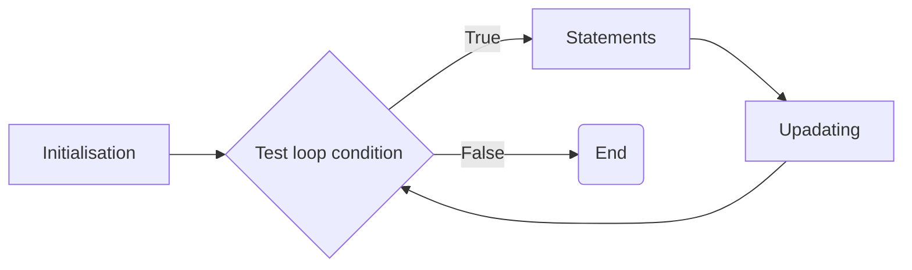
Post-test loop
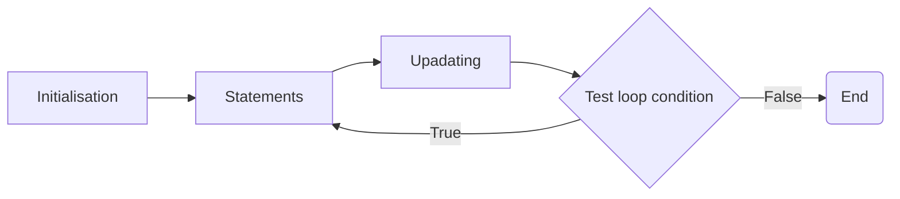
#### While loop
```cpp
int n, sum, counter;
cout << "Enter one number: ";
cin >> n;
sum = 0;
while(counter <= n){
  sum += counter;
  counter++;
}
```

#### For loop
```cpp
int n, sum;
cout << "Enter one number: ";
cin >> n;
sum = 0;
for(int counter = 0; counter <= n; counter ++){
  sum += counter;
}
```
**Variation of for loop**
- several initialization expressions seperated by commas
```cpp
for(int factorial = 1, counter = 1; counter <= n; ++counter){
  factorial *= counter
}
```
- no initialization expressions 
```cpp
for( ; n <= 0; n--){
  cout << "*" ;
}
```
- simple initialization expressions of a delay
```cpp
for(int counter = 1; counter <= n; ++counter);
```
- infinite loop (until terminae inside the loop body)
```cpp
for( ; ; ){
  ...
}
```
- Range for loop
```cpp
for(declaration : expression){
  statement to execute
}
```
---
## Dynamic Memory allocation
- carry out by using a special type of operator that directly communicate with the Menory Manager
- While the programmer has to specify how much memory is reuqired
- So the memory manager will find a location currently available
### > Stack or Heap
- The static objects will be stored in memory on the stack
- Allocation of these memory is at the run-time, and ==use of this memory is persistent==
- Thus we need to explicitly say when we want to stop using it

**Static Variable**
  - the variable persists beyond scope and isn't re-initialized with each call to the function
  - the class variable of which it is shared among the class object.
### `new` & `delete`
- `new` is used to dynamically allocate memory 
- it is a type safe operation, which return a pointer to the typr given
- `delete` is used to free up memory / deallocate the memory
  - this is mandatory to prevent memory leak
```cpp
int * ptr = new int;
delete ptr;       // to deallocate memory


// we can initialise the variables when we setup the memory
int *p = new int(5);

delete p;
```
### `new[]`
- used to create dynamic array
```cpp
int *intArr;
intArr = new int[100];
// initialise array
for(int i = 0; i < 100; i++){
  intArr[i] = 25-i;
}

delete[] intArr;    // deallocate memory for dynamic array
```
### Notes for `delete[]`
Case 1: pointer array of pointers 
```cpp
Person **p = new Person*[2];
p[0] = new Person("Peter");
p[1] = new Person("Alex");
```
- In this case, delete[] will only cause the `p` pointer to be released, not the actual objects
- To delete this: 
  1. loop through the `p` to delete each of the objects by specifying the index `delete p[index]`
  2. After delete all, now you may delete the `p` pointer array
```cpp
void deallocateMemory(){
  for(int i = 0; i < 2; i++){
    delete p[i];
  }
  delete[] p; 
}
```
Case 2: pointer array of pointer array
```cpp
float **fArr;
fArr = new float[10];
for(int i = 0; i < 1; i++){
  fArr[i] = new float[10];
}

// some initialisation

// deallocate memory
for(int i = 0; i < 1; i++){
  delete[] fArr[i];
}
delete[] fArr;

```
---
## Abstract data types
### > Structs
- similar to class
- but the default access specifiers is public (if did not specify)
- can have member function just like a class does (by default they are public)
- use it if the ==members are going to be public== 
**Syntax**
```cpp
struct StudentType{
  int id;
  bool isGrad;
};
```
Declare a new type of struct
```cpp
StudentType s1, s2;
```
Access the individual field of a structure
```cpp
s1.id = 123;
s2.id = s1.id + 1;
s1 = s2;        // copy fields of s2 to s1
```
Nested struct (arbitrarily)
```cpp
struct AddressType{
  string city;
  int zip;
};
struct StudentType{
  int id;
  bool isGrad;
  AddressType addr;
};
```
Access the nested struct fields
```cpp
StudentType s3;
s3.addr.zip = 53706;
```

member function
```cpp
struct Test{
  string name;
  int number;
  void setTest(string, int);
  void showTest();
}

void Test::setTest(string TestName, int TestNumber){
  name = TestName;
  number = TestNumber;
}

void Test::showTest(){
  cout << "Test string " << name << endl;
  cout << "Number for this "  <<number << endl;
}
```
#### static const in struct
- this variable can only be declare and initialise in a struct or class IF IT IS A INTEGRAL / ENUMERATION TYPE
- FOR NON-INTEGRAL TYPE, you can only declare in the struct, and then initialise outside of the struct/class
```cpp
struct Test{
  static const int aStaticInt = 5;
  static const double aStaticDouble;
  // static const double aStaticDouble = 0.5;     
  // error: 'constexpr' needed for in-class initialization of static data member 'const float Test::aStaticDouble' of non-integral type [-fpermissive]
  static const string aStaticString; 
  // static const string aStaticString = "Hello world"; 
  // error: in-class initialization of static data member 'const std::string Test::aStaticString' of non-literal type
};

const double Test::aStaticDouble = 0.5;
const string Test::aStaticString = "Hello world";
int main(){
  Test test;
  cout << test.aStaticInt << endl << test.aStaticString << test.aStaticDouble << endl;
    
  return 0;
}
```
### > Unions
- similar to struct
- but the fields of a union all share the same memory
  ```cpp
  union myType{
    int i;
    float f;
  }
  ```
---
## Randomness 
### > old school version
```cpp
#include <iostream>
using namespace std;

int main(){
  srand(time(0));

  for(int i = 0; i <> 20; i++){
    cout << rand() << endl;
  }

  return 0;
}
```
Output :
```shell
21486
1521
22594
20851
23005
22362
680
7584
7550
30017
19157
19124
17332
16270
25951
32253
21344
32046
10965
26081
```
- Limitation
  - cannot get different range
  - only get integer
  - uniform distribution   
### > C++11 version 
- the output is fixed
- can provided integral seed
- can set the range to uniform range
- can set the range to normal distribution
- **Basic random declaration**
  ```cpp
  #include <random>
  #include <iostream>
  #include <string>
  
  using namespace std;
  
  int main(){
    default_random_engine randEng;
    for(int i = 0; i < 10; i++){
      cout << randEng() << endl;
    }
  }
  ```
  Output: 
  ```shell
  16807
  282475249
  1622650073
  984943658
  1144108930
  470211272
  101027544
  1457850878
  1458777923
  2007237709
  ```
- **get the min and max of the random**
  ```cpp
  default_random_engine randEng;
  cout << "min: " << randEng.min() << endl;
  cout << "max: " << randEng.max() << endl;
  ```
  Output : 
  ```shell
  min: 1
  max: 2147483646
  ```
- **To adjust the seed**
  ```cpp
  // adjust seed at the constructor (the seed must be integral seed)
  int seed = 6;
  default_random_engine randEng(seed);

  // or set it later
  default_random_engine randEng;
  randEng.seed(seed)
  ```
- get the uniform random number in a range
  ```cpp
  uniform_int_distribution<unsigned> uniform(0,100);
  default_random_engine randEng;
  for(int i = 0; i < 10; i++){
      cout << uniform(randEng) << endl;
  } 
  ```
  Output :
  ```shell
  0
  13
  76
  46
  53
  22
  4
  68
  68
  94
  ```
- normal distributon range
  ```cpp
  normal_distribution<> normal(6, 2.5);
  default_random_engine randEng;
  for(int i = 0; i < 10; i++){
    cout << normal(randEng) << endl;
  } 
  ``` 
  Output :
  ```shell
  5.69509
  3.28295
  7.71072
  3.31203
  6.08317
  7.86209
  6.08402
  4.68341
  7.15633
  6.50175
  ```
  > if you wish to round it to the nearest integer, then you need to use `lround()`
---
## Exception
### > Intro
- exception
  - unusual occurance
  - error occur during oop execution
  - object that contains information that is passed from the plac ewhere a problem occurs to another place that will handle the problem 
    - can be any type (including basic or class type)
- exception handling
    - oop technique
    - manage such errors, although it doesn't just work with object around
- syntax 
  ```cpp
  try{
    // statement that may throw an exception
  }catch( ){
    // handle you exception here
  }
  ```
- how to `throw` an exception
  ```cpp
  // throw string exception
  void testDate(int day, int month, int year){
    if(day < 1 ||  day > 31){
      throw (string("Invalid day"));
    }
    if(month < 1 || month > 12){
      throw (string("Invalid month"));
    }
    cout << "The day and month is valid: " << day << "-" << month << "-" << year << endl;
  }

  // throw int exception
  void verifyEmail(string email){
    int loc1, loc2;
    string at = "@";
    string dot = ".";
    loc1 = email.find(at);
    loc2 = email.rfind(dot);
    if(loc1 == string::npos){
      throw (1);
    }else{
      cout << at << " found at " << loc1 << endl;
    }
    if(loc2 == string::npos){
      throw (2);
    }else{
      cout << dot << " found at " << loc2 << endl;
    }
    if(loc1 >= loc2){
      throw (3);
    }
    cout << "Email is valid: " << email << endl;
  }
  ```
- after you `throw` the exception, you must `catch` it
  ```cpp
  int main(){
    string email = "email@example.com";
    try{
      testDate(31, 12, 1990);
      verifyEmail(email);
    }catch(string e){       // catch string exception
      cout << "Exception caught: " << e << endl;
    }catch(int i){        // catch int exception
      if(i == 1) 
        cout << "error 1: No @ in email" << endl;
      else if(i == 2) 
        cout << "error 2: Not . in email" << endl;
      else if(i == 3) 
        cout << "error 3: @ before ." << endl;
      else
        cout << "Something wrong." << endl;
    }
    return 0;
  }
  ```

### > Unwinding the stack
- When calling a function, the address where the logic should return at the end of the function is stored in a memory location, AKA ==Stack==.
- Story time:
  - Scenario:
    ```cpp
    void FunctionC() {
        // This function might throw an exception
      if (/* some condition */) {
        throw SomeException();
      }
    }

    void FunctionB() {
      try {
        FunctionC();
      } catch (const SomeException& e) {
        // Handle the exception or rethrow
        throw; // Rethrow the exception
      }
    }

    void FunctionA() {
      try {
        FunctionB();
      } catch (const SomeException& e) {
        // Handle the exception
        std::cerr << "Exception caught in FunctionA: " << e.what() << std::endl;
      }
    }

    ```
  - Function A will call Function B, and Function B will call Function C.
  - At some condition, Function C throws an exception. But there is no try catch block within Function C that will handle the exception. Thus the runtime unwinds that stack.
  - The runtime moves up the call stack to the calling function B, which a try catch block found matched the type of exception thrown by Function C.
  - However, sometime the exception handler which we defined may not able to handle the exception. Thus the exception can be ==rethrown==
  - If exception is rethrown in Function B, then the runtime will rewind the stack again until it find a try catch block which use to handle thi s exception. 
  - If the exception is not caught in the end of the stack, the program may terminated. 
---
## Namespace
### > Intro
- optional scope
- help limit the concern about the naming clashes 冲突
- to avoid name duplication
- syntax for delaring
  ```cpp
  namespace name_of_namespace{
    // declaration here
  }
  ```
- syntax of accesing
  ```cpp
  name_of_namespace::function_name();
  name_of_namespace::variable_name;

  // btw you can bring the namespace into scope using `using` keyword
  using namespace name_of_namespace;
  // after bringing namespace into scope
  function_name();
  variable_name;
  ```
-----------------------**Example 1**-----------------------
```cpp
#include <iostream>
using namespace std;

namespace NS{
  int i;
}

namespace NS{
  int j;
}

int main(){
  NS::i = NS::j = 10;
  cout << NS::i * NS::j << endl;

  using namespace NS;
  cout << i * j << endl;
  return 0;
}
```
Output : 
```shell
100
100
```

-----------------------**Example 2 : Name Clashes**-----------------------
***counter.h***
```cpp
#ifndef _COUNTER_H_
#define _COUNTER_H_
// global variable within the counter.h
int upperbound;
int lowerbound;
class counter {
    public:
        counter(int n) {
                if(n<=upperbound) count = n;
                else count = upperbound;
        }
        void reset(int n){
                if(n<=upperbound) count=n;
        }
        int run() {
                if(count > lowerbound) return count--;
                else return lowerbound;
        }
    private:
    // local variable in this class 
        int count;
};
#endif
```
***delay.h***
```cpp
#ifndef _DELAY_H_
#define _DELAY_H_
// global variable within the delay.h
int upperbound;
int lowerbound;
class delay {
   private:
   // local variable within the class
       int count;

   public:
        delay(int n) {
                if(n<=upperbound) count = n;
                else count = upperbound;
        }
        void reset(int n){
                if(n<=upperbound) count=n;
        }
        int run() {
                if(count > lowerbound) return count--;
                else return lowerbound;
        }
};
#endif
```
***main.cpp***
```cpp
#include <iostream>
#include "counter.h"
#include "delay.h"      
using namespace std;

int main(){
  return 0;
}
```
In the time of compiling:
```shell
In file included from main.cpp:3:
delay.h:4:5: error: redefinition of 'int upperbound'
    4 | int upperbound;
      |     ^~~~~~~~~~
In file included from main.cpp:2:
counter.h:4:5: note: 'int upperbound' previously declared here
    4 | int upperbound;
      |     ^~~~~~~~~~
delay.h:5:5: error: redefinition of 'int lowerbound'
    5 | int lowerbound;
      |     ^~~~~~~~~~
counter.h:5:5: note: 'int lowerbound' previously declared here
    5 | int lowerbound;
      |     ^~~~~~~~~~
```
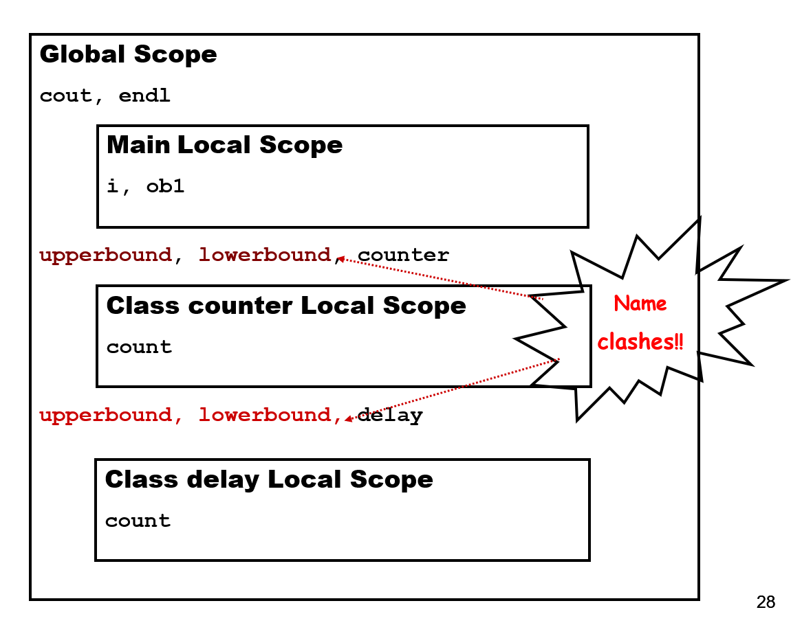
***To avoid this***
***delay.h***
```cpp
#ifndef _DELAY_H_
#define _DELAY_H_
// global variable within the delay.h
namespace NS_Delay{
  int upperbound;
  int lowerbound;
  class delay {
  private:
    // local variable within the class
    int count;
  public:
    delay(int n) {
      if(n<=upperbound) count = n;
      else count = upperbound;
    }
    void reset(int n){
      if(n<=upperbound) count=n;
    }
    int run() {
      if(count > lowerbound) return count--;
      else return lowerbound;
    }
  };
}
#endif
```
***main.cpp***
```cpp
#include <iostream>
#include "counter.h"
#include "delay.h"      
using namespace std;

int main(){
  // defined in counter.h
  upperbound = 5000l
  lowerbound = 1;
  counter c1(10);

//  defined in delay.h -> namesace: NS_Delay
  NS_Delay::upperbound = 100;
  NS_Delay::lowerbound = 20;
  NS_Delay::delay s1(30);
  return 0;
}
```
Question time:
Given `date::year`, what is date? Class? Namespace?
[Answer](./Namespace/answer.md) 

### > Use namespace locally
```cpp
#include<iostream>

void func1() 
{
    using namespace std;      // the namespace std is only use in func1
    cout << "This is func1" << endl;
}

void func2() 
{
    std::cout << "This is func2" << std::endl;
}

int main() 
{
    func1();		
    func2();
    std::cout << "This is Main" << std::endl;
    return 0;   
}
```
### > Unamed Namespace
- AKA anonymous namespace
- allow us to establish unique identifier
- known only within the scope of a single file
- [encapsulation](Readme.md#-encapsulation) 
- syntax
```cpp
namespace{
  // declaration
}
```
### > Nested Namespace
```CPP
namespace ITDept{
  namespace DBDept{
    class UserAccount{...}
  }
  namespace GUIDept{
    class UserAccount{...}
  }
  namespace AIDept{
    class UserAccount{...}
  }
}

int main(){
  using namespace ITDept;
  DBDept::UserAccount user1;
  GUIDept::UserAccount user2;
  AIDept::UserAccount user3;
  return 0;
}
```
**Why do we use nested namespace:**

1. **Organization**
   - Nested namespaces help organize related code into logical groups, making large codebases more manageable.
   - e.g. ITDept can manage many department such as DBDept, GUIDept and AIDept.

2. **Avoiding Collisions**
   - They prevent naming conflicts by allowing common names to be used in different contexts without conflict.
   - e.g. `DBDept::UserAccount user1;` & `GUIDept::UserAccount user2;`

3. **Encapsulation**
   - Nested namespaces facilitate encapsulation and information hiding by controlling access to code within different levels of the namespace hierarchy.

4. **Library Design**
   - They provide a clear and intuitive interface for libraries or frameworks, guiding users to find the features they need easily.

5. **Versioning**
   - Nested namespaces support namespace evolution and versioning, ==allowing for backward compatibility== and easier management of changes over time.


### > Inline namespace
***Before using inline namespaces***
```cpp
namespace myLib{
  #include "FifthEd.h"      // contain additional functions that ForthEd.h do nnot provide
  #include "FourthEd.h"
}
```
***After using inline namespaces***
```cpp
namespace myLib{
  #include "FortranEd.h"      // the user still can use the previous version function
  inline namespace FifthEd{
    // implement new function
  }
}
```
### > Namespace alias
- suppose we have the following
  ```cpp
  namespace University_of_Wollongong 
  {
    int student();
    namespace Nest_SCIT; 
    {
      void a() { j++; }
      int j;
      void b() { j++; } 
    }
  }
  // by applyying alias 
  // to normal namespace
  namespace UOW = University_of_Wollongong;
  // to nested namespace
  namespace SCIT = University_of_Wollongong::Nest_SCIT;
  
  int main(){
    cout << UOW::student() << endl;
    SCIT::a;
    cout << SCIT::j << endl;
  }
  ```
---
## Class and UML
### > What is a class
- user defined data type
- provide ==description== for the building type
- provide ==prototype(blueprint)== for objects
- provide ==convenient way to group related data== and the ==function which are used to process the data==
- Abstract data type > a type that we define
### > Access Specifier/Modifier
1.  public
    - directly access from outside of the object 
2.  private
    - can only be directly access within the class that declares them
    - but not accessible by the derived class
3.  protected
    - can be directly access by the class that declares them and the derived class 
    - but not the arbitary external objects
### > Encapsulation
- encapsulate component = hide them in a container
- implement it using `private`
- why?
  - a variable may have limited range
  - a variable may require specific output
### > Static
- to avoid data replication and it is shared between instance of the same class
- Field
  - Class attribute/ variable
    - To define a shared data for the class intances
  - Class methods
    - to define behaviour of classes that may not be associated with an instance
    - can use to acccess static variaable
  - Instance attributes/variables
  - Instance methods
### > `this` pointer
- It is automatically supplied when we call a non-static member function of a class
- e.g. `clerk.displayValues();`
  - actual: `displayValues(&clerk);` 
  - the argument list used by the compiiler: `displayValues(Employee *this)`
- However, we can still use `this` pointer explicitly
  ```cpp
  void Employee::displayValues(){
    cout << "Employee #"<< (*this).employeeNum << "Company #" << (*this).companyIdNum << endl;
  }
  ```
- But this is ridiculous as the parenthesis is required to dereference the `this` pointer
- ==Pointer-to-Member== Operator is coming to solve this problem
  ```cpp
  void Employee::displayValues(){
    cout << "Employee #"<< this->employeeNum << "Company #" << this->companyIdNum << endl;
  }
  ```
- Another reason of using Pointer-to-Member operator (to differentiate the class field and a local variable)
  ```cpp
  void setName(string name){
    this->name = name;
  }
  ```
### > UML
- provides an unambiguous mechanism to describe technical systems.
- Three basic model
  - Functional View
    - what should the system do
    - e,g, Use cases, use case diagrams
  - Structural View
    - how must the system be implemented
    - e.g. class diagram, object diagram
  - Behavioural View
    - how does the system operate
    - interaction diagram, state diagram
---
## Constructors and Desctructors
### > Types of Member Functions
- **Inpector functions (access functions/ getter)**
  - return information about an object's state, or display some or all of an object's attributes
  - e.d. getName(), toString()
  - Subcategory > **predicate function**
    - test various conditions
    - e.g. isDigit(), fail() 
- **Mutator functions (implementors/ setter)**
  - functions that change an object's attributes value
  - e.g. setName(), setAge()
- **Auxiliary functions (facilitators)**
  - function that perfom actions or services
  - e.g. sortAscending(), findLowestValue()
- **Object Management functions**
  - constructor 
    - create object
  - destructor
    - destroy object
> However, in this part we only focus on Object management functions 
### > Object Management
#### Constructor
- called automatically
- initializes the object in specified way
- no return type
- Two basic types
  - default (no arguments)
  - non-default (at least one argument)
#### Desctructor
- similar to constructor function but with the leading tilde`~` 
- called for an object whenever the object goes out of scope
- no parameter and no return type
- allow memory to be release
- avoiding memory leak
-----------------------**Example 1: Without Desctructor**-----------------------
```cpp
#include <iostream>

class MyClass {
public:
    MyClass() {
        std::cout << "Constructor called\n";
    }
};

int main() {
    MyClass* objPtr = new MyClass();
    delete objPtr; // Memory deallocation
    return 0;
}
```
Output :
```shell
Constructor called
```
-----------------------**Example 2: With Desctructor**-----------------------
```cpp
#include <iostream>

class MyClass {
public:
    MyClass() {
        std::cout << "Constructor called\n";
    }
    
    ~MyClass() {
        std::cout << "Destructor called\n";
    }
};

int main() {
    MyClass* objPtr = new MyClass();
    delete objPtr; // Memory deallocation
    return 0;
}
```
Output :
```shell
Constructor called
Destructor called
```
#### Question time: 
1. since both of them have to delete the pointer object when we exit the program, why we still need the descturctor?
   1. **Resource Management**
       - If ==the class holds any dynamically allocated memory or external resources== (like file handles or network connections), the destructor provides a convenient place to release those resources, ensuring that no memory leaks or resource leaks occur.
    2. **Custom Cleanup Logic**
         - A destructor allows you to define custom cleanup logic specific to your class. 
         - For example, you may need to close files, release locks, or log information before the object is destroyed.
    3. **Guaranteed Cleanup**
         - By explicitly defining a destructor, you ensure that cleanup operations are performed even if exceptions occur during the lifetime of the object. 
         - This helps maintain program correctness and prevents resource leaks.
    4. **Class Invariants**
         - Destructors can be used to enforce class invariants or state consistency. 
         - They ensure that the object is left in a valid state when it is destroyed, which can be important for maintaining program integrity.
    5. **Clearer Code Intent**
         - Explicitly defining a destructor communicates the intent of the class more clearly to other developers. 
         - It indicates that resource cleanup is an essential part of the class's functionality.
2. Can constructor be private
   - Yes
   - Reason to make it private:
      1. we may create an object with certain values only under conditions controlled from within an object 
      2. Can be used in the context of [inheritance](#-inheritance)
### > Copy And Moving
#### Copy
- in two form
  - implicit
    - the compiler makes a copy of the content of an object into a new memort location of the same type
  - explicit
    - programmer specifies that a particular object's values are to be transferred to the memory location of another object
1. Copy Constructor
   - This is defined whether we specify other constructors or not, if it’s needed by the compiler
     - If implicitly, the compiller will perform member-wise copy of thedata members from the source object to the new object
   - Why we explicitly define our copy constructor
      1. when your class contains dynamically allocated memory
      2. file handling
      3. other resource that need to be properly managed during copying
   - When is it been invoked
     - Declare an object and use it to initialise another object of the same class
      ```cpp
      Point p1(p2);
      Point p1 = p2;
      ```
     - Pass an object by value to a function
      ```cpp
      float getDistance(Point pointA);
      ```
     - Return an object by value from function
      ```cpp
      Point getPosition();
      ```
2. Synthesised copying / Copy Assignment
     - The defult synthesised copy constructor makes a member-by-member copy of ==non-static data members== of the objects
    - Problem occur when copying pointers or dynamic memory, it may be too ==shallow==
      - a shallow copy of that object will copy the memory addresses stored in those pointers, rather than creating new memory space for the copied object's data
      - To solve this problem, we need to define a custom copy constructor which will perform a deep copy
    - *shallow*
    ```cpp
    class Pointier 
    {
      public:
        int *x;
        Pointier()	{ x = new int(5); }
        void display()	{ cout << *x << endl; }
    };
    int main(){
      Pointier PointA;
      Pointier PointB(PointA);
      PointA.display();
      PointB.display();
      *(PointB.x)=3;
      PointA.display();
      PointB.display();
    }
    ```
    ```shell
    5
    5
    3
    3
    ```
    - *Deep copy*
    ```cpp
      class Pointier 
    {
      public:
        int *x;
        Pointier()	{ x = new int(5); }
        Pointier(const Pointier& point){x = new int(*point.x);}
        void display()	{ cout << *x << endl; }
    };
    int main(){
      Pointier PointA;
      Pointier PointB(PointA);
      PointA.display();
      PointB.display();
      *(PointB.x)=3;
      PointA.display();
      PointB.display();
    }
    ```
    ```shell
    5
    5
    5
    3
    ```
  1. Copy Assignment Operator: `X& operator=(const X&)`
      - copy assignment + operator overload
      - both object must be initialise first
      - perform deep copy as needed just like the copy constructor
      - It will return a reference of their left-hand operand
      ```cpp
      class Pointier 
      {
      public:
          int *x;
          Pointier(){x = new int(1);}
          Pointier(int num){
              x = new int(num);
          }
          Pointier& operator=(const Pointier& point){
              x = new int(*point.x);
              return *this;
          }
          void display()	{ cout << *x << endl; }
      };


      int main(){
          Pointier PointA(5), PointB;
          PointA.display();
          PointB.display();
          cout << "Copy PointA to PointB: " << endl;
          PointB = PointA;
          PointA.display();
          PointB.display();
          cout <<  "Change x of PointB to 3:" << endl;
          *(PointB.x)=3;
          PointA.display();
          PointB.display();

          return 0;
      }
      ```
      Output : 
      ```shell
      5
      1
      Copy PointA to PointB:
      5
      5
      Change x of PointB to 3:
      5
      3
      ```
##### > Summary for copy contructor and copy assignment
> while both the copy constructor and copy assignment operator are used to create copies of objects, the copy constructor is invoked during object creation or initialization, while the copy assignment operator is invoked after the objects have been initialized, when one object is assigned the value of another.

#### Moving
1. Move Constructor : X(X&&);
   - destroy the thing that being copied after copying
   - Purpose:
      1. Efficiency
     - Move constructors allow for the transfer of resources without the overhead of deep copying. 
     - Instead of duplicating the resource, ownership of the resource is transferred from the source object to the destination object.

      2. Avoiding Unnecessary Copies
        - In scenarios where temporary objects are created during expressions or function returns, move constructors can prevent unnecessary copies by efficiently moving resources from the temporary object to the destination object.

      3. Performance Optimization
        - By utilizing move semantics, move constructors can significantly improve the performance of operations involving resource management, such as resizing containers or passing objects by value.

      4. Resource Management
        - Move constructors are essential for managing resources that cannot be easily copied or duplicated, such as file handles, database connections, or large dynamically allocated memory blocks
      ```cpp
      #include <utility>
      #include <iostream>
      #include <string>

      using namespace std;

      class Test {
      private:
          int* data; // Pointer to dynamically allocated data

      public:
          // Constructor
          Test(int value) : data(new int(value)) {
              cout << "Constructor called for " << value << endl;
          }

          // Move constructor
          Test(Test&& other) noexcept : data(other.data) {
              cout << "Move constructor called for " << *data << endl;
              other.data = nullptr; // Reset the source object's pointer
          }

          // Destructor
          ~Test() {
              delete data; // Deallocate dynamically allocated memory
              cout << "Destructor called \n";
          }

          // Print method
          void print() const {
            if(data != nullptr){
            cout << "Data: " << *data << std::endl;
            }else{
              cout << "Data does not exists\n";
            }
          }
      };


      int main(){
          Test obj1(100); // Create object with value 100
          Test obj2(move(obj1)); // Move construct obj2 from obj1

          obj1.print(); // Accessing obj1 after move is safe but undefined behavior
          obj2.print(); // Print the value stored in obj2

          return 0;
      }
      ```
      Output : 
      ```shell
      Constructor called for 100
      Move constructor called for 100
      Data does not exists
      Data: 100
      Destructor called
      Destructor called
      ```
      - It is not only applicable to custom class object
      ```cpp
      #include <utility>

      int interger = 10;
      int &ref = integer; // normal referencing and copy value
      int &&ref2 = move(integer); //the value of integer is copied to ref2, but itself is not being destroyed
      ``` 
2. Move Assignment : `X& operator=(X&&)`
    ```cpp
    #include <utility>
      #include <iostream>
      #include <string>

      using namespace std;

      class Test {
      private:
          int* data; // Pointer to dynamically allocated data

      public:
          // Constructor
          Test(int value) : data(new int(value)) {
              cout << "Constructor called for " << value << endl;
          }

          // Move operator
          Test2& operator=(Test2&& rhs) noexcept{
              cout << "Move assignment called" << endl;
              if(this != &rhs){
                  delete data;
                  data = rhs.data;
                  rhs.data = nullptr;
              }
              return *this;
          }

          // Destructor
          ~Test() {
              delete data; // Deallocate dynamically allocated memory
              cout << "Destructor called \n";
          }

          // Print method
          void print() const {
            if(data != nullptr){
            cout << "Data: " << *data << std::endl;
            }else{
              cout << "Data does not exists\n";
            }
          }
      };

    int main(){
      Test2 obj1(10);
      Test2 obj2(0);
      cout << "\nBefore move assignment\n";
      obj1.print();
      obj2.print();

      obj2 = move(obj1);
      cout << "\nAfter move assignment\n";
      obj1.print();
      obj2.print();

      return 0;
    }
    ```

#### Summary of the copy and moving syntax
 |Special Member Function|For Class X|
 |---|--|
 |Copy constructor|`X(const X&);`|
 |Copy assignment|`X& operator=(const X&);`|
 |Move constructor (C++ 11)|`X(const X&&);`|
 |Move assignment (C++ 11)|`X& operator=(const X&&);`|
 
---
## Overloading 
### > Function Overloading
- same function name but different parameters lists
```cpp
int getMax(int x, int y){
  if(x > y)return x;
  else return y;
}
char getMax(double x, double y){
  if(x > y)return x;
  else return y;
}
```
> The definition/logic of the function supposed to be different
> If there are the same, we can just used the [function template](#function-template)
### > Problem with the overloading
-----------------------**Example 1**-----------------------
- Providing the default values for the fucntion arguments while the return type are the same
- This make the compiler to confuse, which function should be called
```cpp
void calculation(int num = 1);
void calculation(double num = 0.1);
```
-----------------------**Example 2**-----------------------
- different return type but providing the same function argument list
- make the compiler to confuse, which function should be called since both the argument list are the same
```cpp
int getMax(int x, int y);
double getMax(int x, int y);
```
### > Operator Overloading
- allow us to define operator for our own abstract data types
- Things to be aware
    1. Properties of the operator which cannot be change:
     -if an operator is normally defined to be unary only, then we cannot overload it to binary 
         - unary -> require single operand, 
         - binary -> require double operand
    2. operator that cannot be overloaded
        - dot operator (`.`)
        - pointer operator (`*`)
        - scope resolution operator (`::`)
        - conditional operator (`?:`)
        - function `sizeof()`
    3. cannot overload symbols which are not predifined operator
    4. Operators cannot be overloaded for the basic C++ types.
### > Ways to define operator overloading:
  1. member functions
     1. A function that overload =, (), [] or -> for a class must be a member function for this class.
     2. Function prototype: 
        ```cpp
        ClassName operatorSymbol (const ClassName&) const;
        ```
     3. Function definition: 
        ```cpp
        ClassName ClassName::operatorsymbol(const ClassName& obj)const
        {
          statement;
        }
        ```
      [Example](./Overloading/MemberFunction/)
  2. friend functions
     1. if the left operand of the operator is an object of a different class, then a friend function must be defined
     2. Function prototype: 
        ```cpp
        friend ClassName operatorSymbol (const ClassName&, const ClassName&);
        ```
     3. Function definition: 
        ```cpp
        ClassName operatorsymbol(const ClassName& obj1, const ClassName& obj2)
        {
          statement;
        }
        ```
      [Example](./Overloading/FriendFunction/)  
      [More on friend](README.md#-friend)
  3. Copy Assignment Operator
     1. Function prototype: 
        ```cpp
        const ClassName& operator= (const ClassName&) const;
        ```
     2. Function definition: 
        ```cpp
        ClassName& ClassName::operator=(const ClassName& obj)const
        {
          if(this != obj){
            statement;
          }
          return *this;
        }
        ```
        [Example](./Overloading/MemberFunction/)
  4. Relational Operators 
     1. Function prototype: 
        ```cpp
        const bool operator== (const ClassName&)const;
        ```
     2. Function definition: 
        ```cpp
        bool ClassName::operator==(const ClassName& obj)const
        {
          statement;
        }
        ```
        [Example](./Overloading/MemberFunction/)
  5. Stream Operation
      **`<<` operator overloading**
     1. Function prototype: 
        ```cpp
        friend ostream operator<< (ostream&, const ClassName&);
        ```
     2. Function definition: 
        ```cpp
        ostream operator<< (ostream& os, const ClassName& a);
        {
          os << a.attr1 << a.attr2;
          return os;
        }
        ```
      **`<<` operator overloading**
     1. Function prototype: 
        ```cpp
        friend istream operator>> (istream&, ClassName&);
        ```
     2. Function definition: 
        ```cpp
        ostream operator>> (istream& is, ClassName& a);
        {
          is >> a.attr1 >> a.attr2;
          return is;
        }
        ```
        [Example](./Overloading/FriendFunction/FriendFunction.cpp)

---
## Class/Object Relation
### > Multiplicity
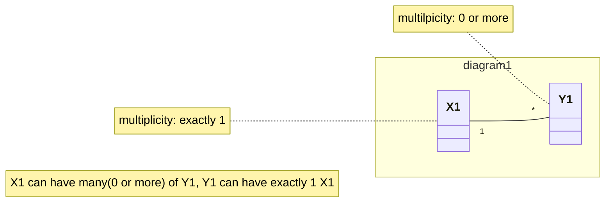
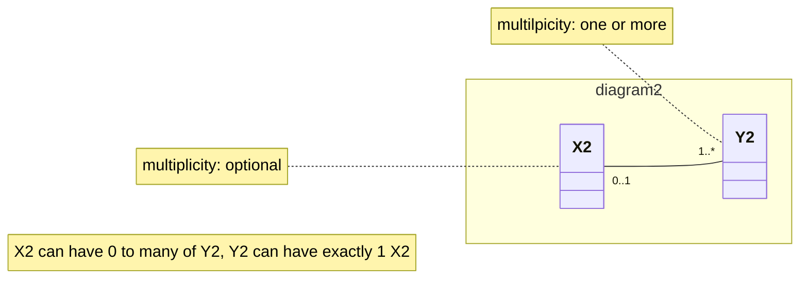
### > Dependency
- one directional relaionship
- a class is using another class or is depending on another class
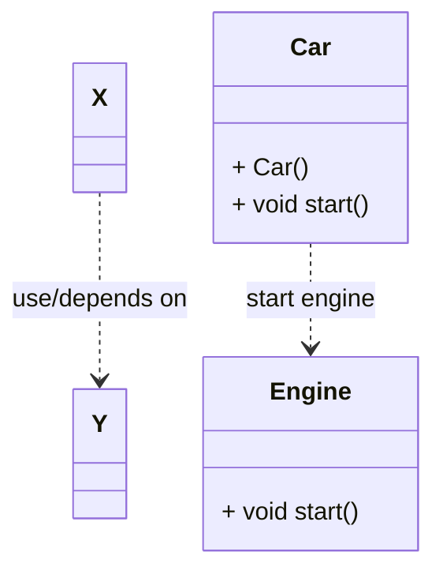
*Implementation code*
```cpp
class Engine;
class Car{
private:
  ...
public:
  void start(Engine *engine)
  {
    engine->start();
  }
}

class Engine{
private:
  ...
public:
  ...
  void start(){
    ...
  }
}

int main(){
  Car *car1 = new Car();
  Engine *engine1 = new Engine();
  car1->start(engine1);
  return 0;
}
```
### > Association
- a class retain a relationship with another class
- contain dependency
- this show that one object is related/communicate with another object
- "has a" type of relationship
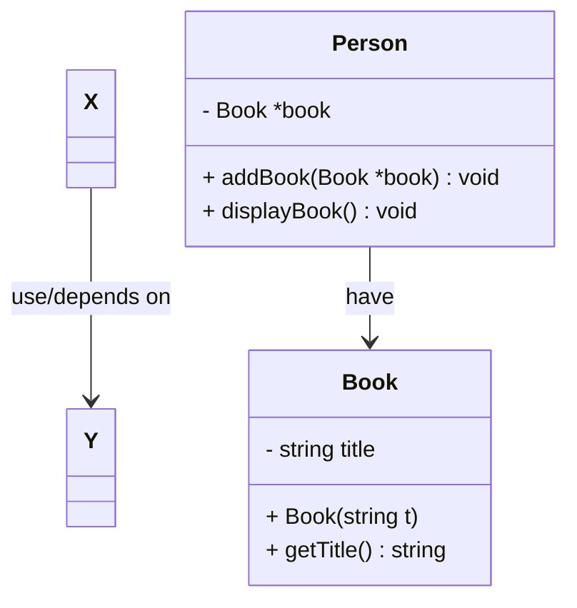

#### > Multiple Association

#### > Labelling Association

> A worker work for many company as employer
> One company have many worker as contractor to them


> An user is an owner of many directory, but one directory must only have one owner
> One User can be authorised to access many directories, one directory can be authorised to many user for accessing  

#### > Self Association

> A person can own no or more property
> One property can be own by 1 or more person
> One person can married to another person as a wife
> One person can be a husband of another person

### > Aggreagation
- stronger association
- reflects `contains` or `owns` type of relationship
- parts can be in several composite
- ==destruction of the container/composite doesn't destroy the parts==
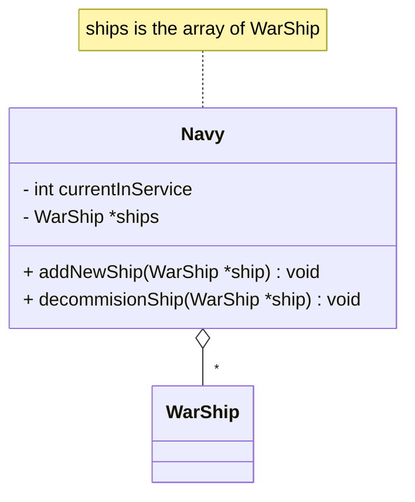
### > Association vs Aggregation
- major difference
  - aggregation has a container that `contain`/`owns` component object 
*Association*
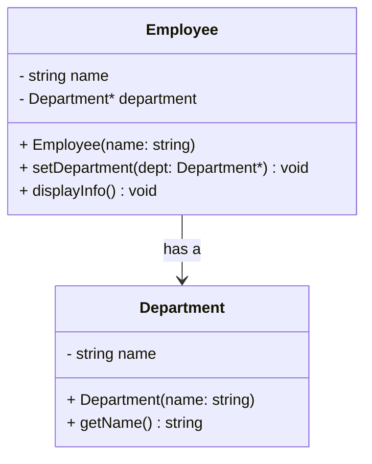
*Aggregation*
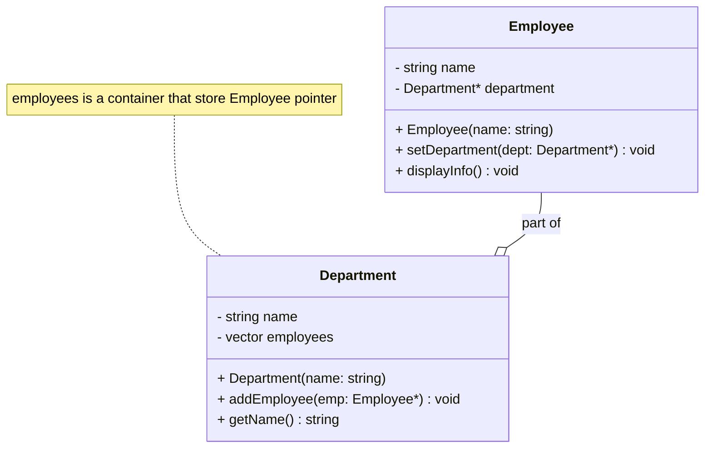
### > Composition
- stronger version of aggregation
- the lifespan of the part is synchronised with the container 
- parts can be included in one instance at one time
*Normal Array*
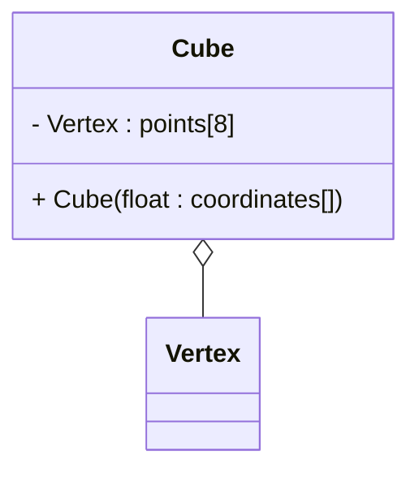
*Dynamic Memory Allocation*
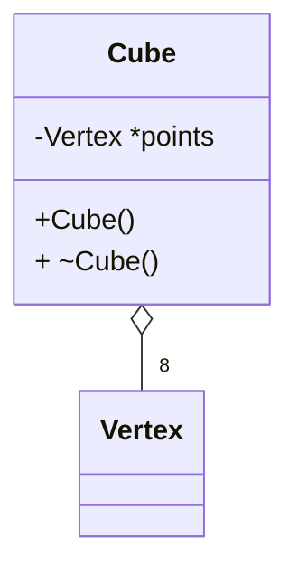
> The destructor will delete all the object in the container by `delete[] points`

### > Nested Class
- Nested class does not contain the attribute of the outer class
- but can access those attributes
```cpp
class A{
private:
  int a;
  classB{
    private:
      int b;
    public:
      // contructor for B
      B(int bb) : b(bb){}
  }
public:
  // constructor for A
  A(int aa) : a(aa) {}
  class C{
    private: 
      int c;
    public:
      // constructor for C
      C(int cc) : c(cc) {}
  } 
}

int main(){
  A a(5);
  A::C c(10);

  A::b b(5);    // inaccessible

}
```


### > Inheritance
- new classes created from existing class
- absorbing their attributes and behaviours
- adding, changing or replacing some of the behaviours
#### Advantages
- A substantial part of the code is already written
- base class is extendable without duplicating the existing base class properties
- reliable as existing code is tested
- we can have collections od multiple related types due to "is a" relationship
#### Derived class
- inherits attributes and behaviour from its base class
- add new properties to those inherited from the base class
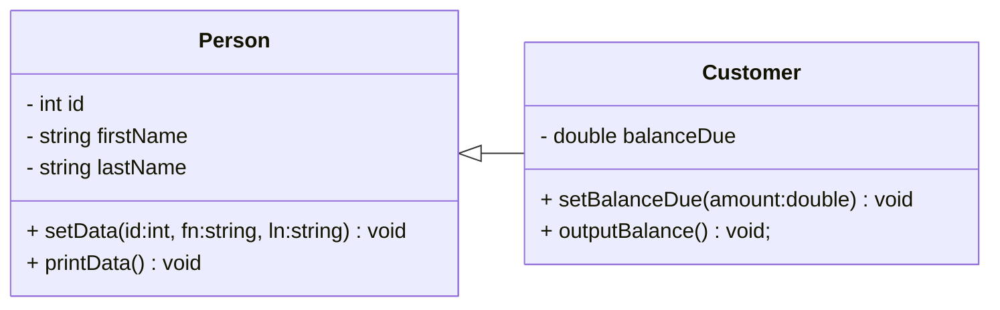
```cpp
class Person{
private:
  int id;
  string firstName;
  string lastName;
public:
  void setData(int id, string fn, string ln){
    this->id = id;
    this->firstName = fn;
    this->lastName = ln;
  }
  void printData(){
    cout << "ID: " << idNum << ", Name: " << firstName << " " << lastName << endl;
  }
}

class Custmer{
private:
  double balanceDue
public:
  void setBalanceDue(double amount){
    balanceDue = amount;
  }
  void outputBalance(){
    cout << "Balance due $" << balanceDue << endl;
  }
}

int main(){
  Customer cust1;

  cust1.setData(1, "John", "Wick");
  cust1.printData();

  cust1.setBalanceDue(50);
  cust1.outputBalance();
}
```
The following is never inherit by the derived class:
- Constructor
- Destructor
- friend function   (need to redefine again)
- Overload new operator
- Overload = operator (need to redefine again)
---
## Polymorphism and Multiple inheritance
### > What is Polymorphism?
- not only inheritance
  - retain base behaviour
  - add new behaviour
- But also want to ==MODIFY BASE BEHAVIOURS (Override)==
  - provided the derived class function have the same name, signature and return type
```cpp
class Employee{
protected:
    char *firstName;
    char *lastName;
public:
    Employee(const char *first, const char *last) {
        firstName = new char[strlen(first) + 1];
        lastName = new char[strlen(last) + 1];
        strcpy(firstName, first);
        strcpy(lastName, last);
    }
    ~Employee(){
        delete[] firstName;
        delete[] lastName;
    }

    void print() const{
        cout << "Employee::print() called" << endl;
        cout << firstName << " " << lastName << endl;
    }

    void display(int num) const{
        cout << "Employee::display() called" << endl;
        cout << firstName << " " << lastName << endl;
    }
};

class Contractor : public Employee{
private:
    float rate;
    float hours;
public:
    Contractor(const char *first, const char *last, float r, float h) : Employee(first, last), rate(r), hours(h){}
    float getPay() const {return rate * hours;}
    void print() const{
        cout << "Contractor::print() called" << endl;
        Employee::print();          // way to call the base class method
        cout << " is a contractor with pay of $" << setiosflags(ios::fixed | ios::showpoint) << setprecision(2) << getPay() << endl;
    }

    void display(){
        cout << "Contractor::display() called" << endl;
        cout << firstName << " " << lastName << endl;
    }
};
```
```cpp
int main(){
    Contractor ct1("Bob", "Smith", 40, 10);
    ct1.print();
    cout << "\nbreak point\n" << endl;
    ct1.Employee::print();

    cout << "\nbreak point\n" << endl;
    cout << "Calling the base class and derived class display()" << endl;
    ct1.display();
//    ct1.display(2);
    ct1.Employee::display(2);
}
```
*The mothod display(int) is hidden*
- we can access the derived class `display()` by `ct1.display()`
- the base class `display(int)` has a different signature, and suppose can be accessed by `ct1.display(2)`. Unfortunately no.
- It is ==OUT OF SCOPE==
#### > Step for any class member function is called
1. The compiler will look for the member function in the derived class which match the function name
2. If not found, it will look for the function in the base class
3. If not found, it continues up the inheritance hierarchy, until it finds the function
4. If it does not found the function at any class in the hierarchy, this will result in compilation error  

#### > `static_cast`
- can be used to store the content of an object as if were of a different type
- let the compiler know that we are okay to ==downgrading== the precision  
```cpp
    Contractor ct1("Bob", "Smith", 40, 10);
    cout << "use derived class reference" << endl;
    Contractor& r1 = ct1;
    r1.print();

    cout << "\nbreak point\n" << endl;

    cout << "use base class reference" << endl;
    Employee& r2 = ct1;
    r2.print();

    cout << "\nbreak point\n" << endl;

    cout << "use derived class pointer" << endl;
    Contractor* p1 = &ct1;
    p1->print();

    cout << "\nbreak point\n" << endl;

    cout << "Use base class pointer" << endl;
    Employee* p2 = &ct1;
    p2->print();

    cout << "\nbreak point\n" << endl;

    cout << "Using static_cast" << endl;
    // p1 = Contractor* and p2 = Employee*
    // static cast the base class pointer to derived class pointer
//    p1 = p2;          // incompatible pointer type assigned to Contractor* from Employee*
    p1 = static_cast<Contractor*>(p2);
    p1->print();
```
Output:
```shell
use derived class reference
Contractor::print() called
Employee::print() called
Bob Smith
 is a contractor with pay of $400.00

break point

use base class reference
Employee::print() called
Bob Smith

break point

use derived class pointer
Contractor::print() called
Employee::print() called
Bob Smith
 is a contractor with pay of $400.00

break point

Use base class pointer
Employee::print() called
Bob Smith

break point

Using static_cast
Contractor::print() called
Employee::print() called
Bob Smith
 is a contractor with pay of $400.00
```
[Example on polymorphism2()](./Object_Oriented_Programming/main.cpp)

#### > Store them as an array
- Two object is created, one is Contractor type and another one is Employee type
- Both of them can be stored in the same array of base type  
```cpp
    Contractor ct1("Bob", "Smith", 40, 10);
    Employee e1("John", "Doe");

    // Array of Employee
    Employee* employees[2];
    employees[0] = &ct1;
    employees[1] = &e1;
    
    for(int i = 0; i < 2; i++){
        employees[i]->print();
    }
```
Output :
```shell
Employee::print() called
Bob Smith
Employee::print() called
John Doe
```
- However, the result is disappointing 
- It should execute the derived class `print()` method when `employees[0]->print()` which is actually a Contractor is called  
- To solve it, we can use virtual function  
[Example on polymorphism3()](./Object_Oriented_Programming/main.cpp)

#### > Virtual function
- when an object calls a function, the call will go through the vtable(virtual function table) and direct the function call to the relevant version
- which function can be virtual
  - all non-static function
- which function cannot be virtual
  - constructor
- Caution :bangbang:
  - when a class has a virtual function. you should also have a virtual destructor to prevent the following:
  - If a derived-class object has a base class with a virtual function and non-virtual destructor
  - when the derived-class object is destroyed/deleted, the base class destructor will be called, but the derived-class destructor will not be called
```cpp
class Base{
public:
    virtual void print() const{
        cout << "Base::print() called" << endl;
    }
};

class Derived : public Base{
    
public:
    void print() const override {
        cout << "Derived::print() called" << endl;
    }
};

int main(){
        Derived o1;
    Base o2;

    // Array of base class
    Base* arr[2];
    arr[0] = &o1;
    arr[1] = &o2;

    for(int i = 0; i < 2; i++){
        arr[i]->print();
    }
    return 0;
}
```
Output :
```shell
Derived::print() called
Base::print() called
```
### > Abstract Class 
- a class that cannot be instantiated
- How to do it in C++
  - declare at least one pure virtual function
- What is pure virtual function
  - a function that has no implementation
  - a function that is declared with the `= 0` syntax
- Purpose
  - to provide a common interface for all the derived classes
  - to enforce the derived classes to implement the pure virtual function
  - to prevent the instantiation of the base class
```cpp
class Shape{
private:
    string name;
public:
    virtual void draw() = 0;
};

class Square : public Shape{
    
public:
    void draw() override {
        cout << "Drawing a square" << endl;
    }
};

class Rectangle : public Shape{
public:
    void draw() override{
        cout << "Drawing a rectangle" << endl;
    }
};

int main(){
    //    Shape shape;        // error: cannot declare variable 'shape' to be of abstract type 'Shape'
    Square square;
    square.draw();

    Rectangle rectangle;
    rectangle.draw();
    return 0;
}
```
Output :
```shell
Drawing a square
Drawing a rectangle
```
**Warning** :bangbang:
- if you have a pure virtual function in base class
- and you don't override it in the derived class
- the derived class will also become an abstract class as the pure virtual function can be inherited
### > How to stop inheritance
- why to stop
  - the child class is not suitable to be inherited
- declare the class as `final`
```cpp
 class Circle final : public Shape{
public:
virtual void draw() override{
cout << "Drawing a circle" << endl;
}
};
// the following class has en error when it inherit the Circle class
class Oval : public Circle{
public:
void draw() override{
cout << "Drawing an oval" << endl;
}
};
```
**final function**
- a function that cannot be overridden
```cpp
class Oval : public Shape{
public:
    void draw() override{
        cout << "Drawing an oval" << endl;
    }
    virtual void print() final{
        cout << "Oval::print() called" << endl;
    }
};

// the following class has en error when it inherits the Oval class and override the print() 
// as it is a final function
class AnotherShape : public Oval{
public:
    void draw() override{
        cout << "Drawing another shape" << endl;
    }
    
    void print() override{
        cout << "AnotherShape::print() called" << endl;
    }
};
```
### > Multiple Inheritance
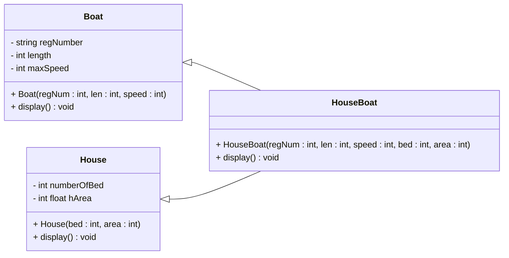
[Example code](./Object_Oriented_Programming/Model.cpp)

### > Diamond Problem
- a famous problem in multiple inheritance
- when a class is derived from two classes that are derived from the same base class
- suppose the previous derived classes has inherited the same attributes from the base class
- now the new derived class that inherit both the derived classes 
  - will end up with access to two seperate base class objects
  - lead to ambiguities and conflicts
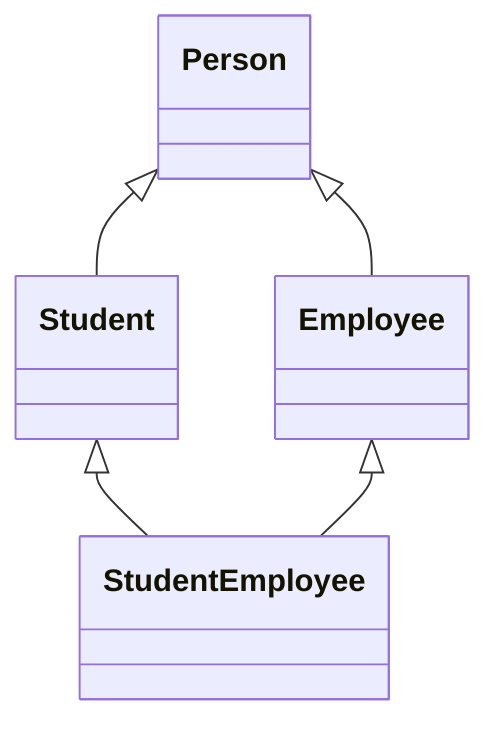
**How to solve this problem**
- add the `virtual` keyword when inherit the base class
- in this case, the compiler will treat the Person to be the base class of the StudentEmployee
- Thus, StudentEmployee will only have access to one copy of the Person class
```cpp
class Person{
    ...
};

class Student : virtual public Person{
    ...
};

class Employee : virtual public Person{
    ...
};

class StudentEmployee : public Student, public Employee{
    ...
};
```

[Example on diamondProblem()](./Object_Oriented_Programming/main.cpp)

---
## Handling files
### > Subheading
---
## Generic Programming
### > Intro
- written in term of to-be-specified-later types
- instantiated when needed for specific types provided as parameter
### > Function Tempplate and Template Functions
- Function Template
  - Prototypes
  - function blueprint that used for generic data type
- Template functions
  - instantiations
### > Syntax
```cpp
template <typename T>
T reverse( T x){
  return -x;
}
```
### > How to call
```cpp
double amount = -9.86;
amount = reverse(amount); // implicit designated parameter type
```
### > Multiple parameter
```cpp
Template <typename T>
T largest( T x, T y, T z){
  T largest;
  largest = (x > y) ? x : y;
  largest = (largest > z) ? largest : z;
  return largest;
}

int main(){
  int x = 8; y = 6; z = 10;
  int largestNum = largest(x, y, z);
}
```
### > Function Template Overloading
```cpp
Template <typename T>
void invert( T &x, T &y){
  T tmp;
  tmp = x;
  x = y;
  y = tmp;
}

Template <typename T>
void invert( T &x){
  x = -x;
}
```
### > Mixed template/non-template function argument
- the argument of a function template does not only have to be the template argument
```cpp
Template <typename T>
void repeatValue(T val, int num){
  for(int i=0; i<num; i++){
    cout << val << " " ;
  }
  cout << endl;
}
```
> Make sure you go have [overload the neccessary operator](#-ways-to-define-operator-overloading) for you own defined class. Or else there will be error when you invoke this function template with your own data type
### > Multiple Generic Parameter
```cpp
template <typename T, typename U>
void displayAndCompare(T val1, U val2) {
    cout << "val1=" << val1 << ", val2=" << val2 << endl;
    if(val1 < val2) 
        cout << "The second one is larger." << endl;
    else if(val1 == val2)
        cout << "They are the same." << endl;
    else
        cout << "The first one is larger." << endl;
}


// recall on operator overloading
class PhoneCall {
    friend ostream& operator<<(ostream&, const PhoneCall&);
    private:
        int minutes;
    public:
        PhoneCall(int = 0);
        bool operator<( const PhoneCall & );  // PhoneCall < PhoneCall
        bool operator<( int n );              // PhoneCall < int
        bool operator==( const PhoneCall & ); // PhoneCall == PhoneCall
        bool operator==( int n );             // PhoneCall == int
};

ostream& operator<<( ostream& ost, const PhoneCall& p ) {
    ost << p.minutes;
    return ost;
}

PhoneCall::PhoneCall(int value) : minutes(value){}

bool PhoneCall::operator<( const PhoneCall& p ) {
  return ( (minutes < p.minutes)? true: false ); 
}

bool PhoneCall::operator<( int m ) {
  return ( (minutes < m)? true: false ); 
}

bool PhoneCall::operator==( const PhoneCall& p ) {
  return ( (minutes == p.minutes) ? true: false ); 
  }

bool PhoneCall::operator==( int m ) {
  return ( (minutes == m)? true: false ); 
}

int main() {
    double a = 3.8, b=4.5, c=6.825;
    float x = 3.1415;
    displayAndCompare( a, b );    
    displayAndCompare( a, x ); 
    
    PhoneCall call1( 5 );
    PhoneCall call2( 8 );
    
    displayAndCompare( call1, call2 );
    displayAndCompare( call1, 5 ); 
}
``` 

### > Explicit type specification
- 
- syntax `someFunction<int>(someArgument)`
- want to limit a nnumber of function generated from a template
- can readily cast between types
```cpp
int a = 10;
float y = 78.09;
cout <<  reverse(a) << endl;
cout << reverse<int>(b) << endl;
```
---
## Class Templates
- similar to function template
e.g.
```cpp
template <typename T>
class Numbewr{
  private:
    T num;
  public:
    Number(const T& a);
    void display();
}
template <typename T>
Number<T>::Number(const T& a){
  num = a;
}

template <typename T>
void Number<T>::display(){
  cout << num << endl;
}
```
---

## Container
### > Intro
- objects that store a collection of other objects
### > Why Container
1. subscript bound checking
   - when we using array like annotation to access the container
   - it will check whether the index is within the valid range of the index
2. memory get tidies up automatically
  - when you add or remove elements from a container, the container automatically allocates or deallocates memory as needed
3. inserting elements anywhere may be made easy
4. pass by reference or value
5. non-static local arrays cannot be return, but objects of container can
    - non-static local arrays have automatic storage duration and are destroyed when the function exits
#### > Queues
- data structure in which elements are removed in the same order thay were enter
- FIFO
#### > Stacks
- data structures in which elements are removed in the reverse order from which they entered 
- LILO
#### > Linked lists
- provide a method of organising stored data based on a logical order of the data
### > Itorators
- object that moves through a container of other objects
- selects tham at one time without providing direct access to the implementation of that container
#### > Smart Pointer?
- designed to be safe
- help us detect when we past the end of the container  

[Example](./Container/main.cpp)

---
## Special Keyword
### > <mark style="background-color:#FFA50035;">`void*`</mark> (void pointer)
- used to hold the address of any type, but without the type being known
  - don't access the content through the void pointers
  - **dereference** won't work in this case
- This is used when we only want to deal with the memory location
  - e.g. sizeof(void *)
- What if we really need to access the content
  - we need to cast it
    - (type *) vptr
  - In this case, the **void pointer** `vptr` will be converted into a **type pointer**  

-----------------------**Example 1**-----------------------
```c++
int i = 5;
int *ip;
void *vp;
ip = &i;  // get the address of the integer variable
vp = ip;  // automatically cast to void* 

// print out
cout << *vp << endl;    // error: expression must be a pointer to a complete object typeC/C++(852)
cout << *((int*)vp) << endl;
```

### > <mark style="background-color:#FFA50035;">`typedef`</mark>
- used to rename basic type
- Format: `typedef actual_type new_name`
```c++
typedef int number;
number one, two, three;
```
- useful to get rid of deferencing operators that are likely to be around with points ...
```c++
typedef double* DataPtr;
DataPtr Index[10];
// instead of 
double* Index[10];
```
- Another way to decalre alias
```c++
typedef double* DataPtr;
using DP = DataPtr;
DP Index[10];
```

### > <mark style="background-color:#FFA50035;">`auto`</mark>
- allow the compiler to figure out the type of something based on the initializer
```c++
auto whatA = 5;
auto whatB = 5.5;
cout << typeid(whatA).name() << endl;
cout << typeid(whatB).name() << endl;
```

```shell
i
d
```
#### Purpose 1 (the type name is hard to know or hard to write)
Before using `auto`
```c++
template<class T> void printall(const vector<T>& v){
  for(typename vector<T>::const_iterator p = v.begin(); p != v.end();++p){
    cout << *p << endl;
  }
}
```
After using `auto`
```c++
template<class T> void printall(const vector<T>& v){
  for (auto p = v.begin(); p != v.end();++p){
    cout << *p << endl;
  }
}
```
> Explanation : the auto keyword automatically deduce the type of the iterator.  
> The compiler determines the type of `p` based on the type of v.begin(), which is `vector<T>::const_iterator`
#### Purpose 2 (grab the return type from an operation)
```c++
string word = "Elephant";
auto length = word.size();
// the size() of a string class return a object of string::size_type
```
#### Purpose 3 (use in for loop which can receive different sequence type but the same format)
```c++
string str("This is a string");
for(auto c : str){
  cout << c << endl;
}
```
#### Purpose 4 (referencing)
```c++
int num = 5, &ref = num;
auto a = ref;
```
[Not clear about how the above code works](#referencing)

#### Things to be aware (Referencing, `const`, `auto`)
- things to consider
  - top-level const : where the object is contanst
  - low-level const : in compound type, with the pointer or reference being a const object
```c++
const int ci = num, &cr = ci;
auto b = ci;    // int  (only copy the value of the constant)
auto c = cr;    // int
auto d = &num;  // int*
auto e = &ci;   // const int*   (copy the address of the constant make the pointer constant)
// top level const : ci, low-level const: e
```
### > <mark style="background-color:#FFA50035;">`decltype`</mark>
- simlar to auto
- allow us to declare type of a variable based on the return type of the function
```c++
int f(){
  return 5;
}

int main(){
  decltype(f()) variable;
  cout << typeid(variable).name() << endl;
}
```
### > <mark style="background-color:#FFA50035;">`nullptr`</mark> (Null Pointer)
- c++ literal that can be converted to any other pointer type
- ways to set pointer which doesn't point to anywhere
  - `int * ptr = 0;`
  - `int * ptr = nullptr`
- `nullptr` != `NULL`
### > <mark style="background-color:#FFA50035;">`const`</mark> vs <mark style="background-color:#FFA50035;">`constextr`</mark>
- object that declared with `const` qualifier cannot change its value
- object that declared with `constextr` qualifier cannot change its value but can evaluate them in the compile time
```c++
`constexpr int square(int x) {
    return x * x;
}`

int main() {
    // Compile-time evaluation of the constexpr function
    constexpr int result = square(5);

    // Output the result
    std::cout << "Square of 5 is: " << result << std::endl;

    return 0;
}
```
#### Summary
both `const` and `constexpr` ensure their respective variables and functions are treated as constants, but `constexpr` additionally guarantees compile-time evaluation when possible
### > <mark style="background-color:#FFA50035;">`sizeof`</mark> operator
- this will return the number of bytes that the type occupies
```c++
sizeof int
sizeof (int)
```
You can do this:
```c++
int value;

cout << "sizeof(int): " << sizeof(int) << endl;
cout << "sizeof(value): " << sizeof(value) << endl;
cout << "sizeof(int*): " << sizeof(int*) << endl;
```
Output :
```shell
sizeof(int): 4
sizeof(value): 4
sizeof(int*): 8
```
> for the sizeof(int*) is not equal to sizeof(int) as a pointer require more space which js enough to store memory location, not the data type. 
> On most 32-bit system, the pointer size is 4, while on 64-bit system, the pointer size is 8 which is double of 32-bit system.
### > <mark style="background-color:#FFA50035;">`unsigned`</mark> operator
- the variables that declare as `unsigned` will only store values that is greater than or equal to 0
- if not, the compiler will still compile it but a  gibberish number will be passed to `cout`
### > <mark style="background-color:#FFA50035;">`friend`</mark> 
- we are not only can  declare a friend function, we can declare a friend class by following way:
  ```cpp
  class ClassA{
    friend class ClassB;
    int a;
  };

  class ClassB{
    void func(ClassA &p){p.a = 1;}
  };
  ```
- friendship is not transitive
  ```cpp
  class ClassA{
    friend class ClassB;
    int a;
  };

  class ClassB{
    friend class ClassC;
  };

  class ClassC{
    void func(ClassA &p){p.a = 1;}
  };
  // ClassC is not a friend of ClassA, thus error show : member "ClassA::a" is inaccessible
  ```
  - friend can access to private and protected members  
    [Example](./Overloading/FriendFunction/FriendFunction.cpp)
  - friend with multiple classes  
    [Example](./Overloading/FriendFunction/FriendFunction.cpp)

---

## Special Concept
### > Singleton
- the class where it can only have one instance at a time
- making the constructor private or protected   
  - to prevent multiple instance to be created
```cpp
class Singleton{
private:
  static Singleton* instance;

public:
  static Singleton* setInstance();
  static void Shoow(){cout << instance << endl;}
  static void TidyUp();

protected:
  Singleton(){};

};

Singleton* Singleton::instance = nullptr;

Singleton* Singleton::setInstance(){
  if(instance == nullptr){
    instance = new Singleton();
  }
  return instance;
}

void Singleton::TidyUp(){
  delete instance;
  instance = nullptr;
}

int main(){
  Singleton::Show();
  Singleton *eg = Singleton::setInstance();

  eg->Show();

  eg->TidyUp();

  Singleton::Show();
}
```

### > Monostate
- all the instance share the same state
- contains only 
  - private static data members
  - public non-static member functions
- Any class can use any instance to control the state of the monostate class
```cpp
class Admin;

class Lab{
friend class Admin;
private:
  static int labCapacity;
public:
  int getLapCapacity(){return labCapacity;}
};

int Lab::labCapacity = 25;

class Admin{
private:
  bool permit;
  string password;
public:
  Admin(string password){
    if(this->password == "") this->password = password;
  }

  bool checkPassword(string password){
    permit = (this->password == password);
    if(permit) cout << "Correct password" << endl;
    else cout << "Incorrect password" << endl;
    return permit;
  }

  void setLabCapacity(int newCapacity){
    if(permit){
      Lab::labCapacity = newCapacity;
    }
  }

};

int main(){

  Lab lab1, lab2;
  Admin admin1("psd1234"), admin2("mypas");

  cout << lab1.getLapCapacity() << endl << lab2.getLapCapacity() << endl;

  if(admin1.checkPassword("psd1234")){
    admin1.setLabCapacity(20);
  }

  cout << lab1.getLapCapacity() << endl << lab2.getLapCapacity() << endl;

  if(admin2.checkPassword("psd1234")){
    admin2.setLabCapacity(30);
  }

  cout << lab1.getLapCapacity() << endl << lab2.getLapCapacity() << endl;
  return 0;
}
```

Output :
```shell
25
25
Correct password
20
20
Incorrect password
20
20
```

### > Singleton vs Monostate
- both have one set of data
  - monostate can have multiple instances
- transparency
  - monostate
    - transparent
    - user doesn't need to change modify their behaviour
    - create monostate class instance in the usual way
  - singleton
    - not transparent
    - require non-standard behaviour